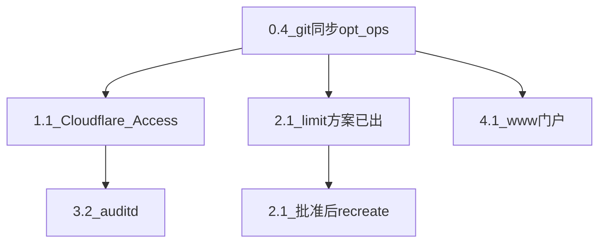

# LosAngeles 优化路线图（默认路径落地）

日期：2026-07-21  
主机：LosAngeles（23.185.200.12）  
约束（已锁定）：单机、不加第二台、不上 Kubernetes  
优先维度（2026-07-21 用户确认）：**A 收口 + B 性能 + D 安全深化 + E 运维效率**（C 可靠性/第二台暂缓）

> 本文是讨论计划的可执行落点：缺口核对 + 只读体检 + 下一步门禁清单。  
> 生产变更仍须按 `standards/05-change-management.md` 单项说明并等待批准。

## 1. 决策摘要

| 项 | 结论 |
| --- | --- |
| 架构 | 继续单机 Compose；不做 HA / 第二台 / K8s |
| 本轮主线 | A 文档/Access 收口 → B 内存 limit 收敛 → D/E 渐进 |
| TCP/Nginx | 2026-07-21 已调优；本轮不再盲调 sysctl |
| 已落地（台账） | 4 条代理域名 `observed_origin_policy` 晋升为 `cloudflare-only` |
| `sub2api` restart_count=3 | 用户确认系主动更新，**不溯源** |

## 2. 第二轮治理缺口（仓库记录 vs 生产只读）

| 项目 | 2026-07-18 记录 | 2026-07-21 只读结论 |
| --- | --- | --- |
| 资产面板 / 漂移 / cron / 脱敏管线 | 待部署 | 生产 textfile 新鲜；`ops_config_drift > 0` = 0 |
| Alertmanager → GitHub Issue | 待 Token | 已启用；PAT 至 2026-08-19 |
| Loki retention | 待 7 天确认 | 已为 720h/30 天 |
| Cloudflare-only 源站 | 待单项确认 | **已生效**（四代理域名直连 403） |
| Cloudflare Access（Grafana） | 待创建 | **2026-07-29 已完成**：指定邮箱 OTP、6 小时会话、GitHub 专用 service token、正常/故障/恢复外部监控验收均通过 |
| Account Vault GHCR digest | 待发布 | 另项，不阻塞本路线图 |

## 3. 只读容量 / 性能体检

| 信号 | 数值 | 判读 |
| --- | --- | --- |
| CPU / Load1 | ~20% / ~1.2 | 正常 |
| Mem available | ~2.2Gi / 3.8Gi | 尚可 |
| Swap | ~284Mi / 512Mi（~55%） | **结构性压力：limit 纸面超卖** |
| 根盘 | 47% | 正常 |
| 容器 | 18 up，OOM=0 | 健康 |
| 业务 5xx/慢请求 | 0 | 无热点 |

2026-07-21 二次采样（sudo `docker stats`）：容器实际占用远低于 limit；见 §4 批次 2 方案表。另见临时容器 `areaforge-ops006-tools` 无有效 mem_limit（显示主机内存），应在不用时删除或补 limit。

## 4. 执行清单

### 批次 0 — 文档台账（进行中 → 同步 `/opt/ops`）

| 步骤 | 状态 | 内容 |
| --- | --- | --- |
| 0.1–0.3 | 已完成 | cloudflare-only 台账、round2 刷新、本路线图已进入主分支 |
| 0.4 | 已完成 | `/opt/ops` 已同步到 `origin/main`，生产基线工作树干净；本次 Grafana 增量另按独立变更闭环 |

### 批次 1 — A 收口（Access，已完成）

| 步骤 | 级别 | 做什么 | 你需要准备 |
| --- | --- | --- | --- |
| 1.1 | 已完成 | Access Application：`monitor.areasong.top`，仅允许指定邮箱 OTP，会话 6h | 2026-07-29 浏览器 OTP 验收通过 |
| 1.2 | 已完成 | Service Token（仅外部探针）→ GitHub secrets `CF_ACCESS_CLIENT_ID` / `CF_ACCESS_CLIENT_SECRET` | #191 正常探针与 #192/#193 故障恢复演练通过；值未进入仓库或聊天 |
| 1.3 | 已完成 | 更新 Cloudflare 台账（owner/到期/轮换） | Token 2027-07-29 到期，2027-06-29 前轮换 |
| 1.4 | L1 | PAT 轮换（2026-08-19 前） | 可稍后 |

手册：[github-external-uptime.md](../playbooks/github-external-uptime.md)

### 批次 2 — B 内存 limit 下调方案（**仅方案，未 recreate**）

依据 2026-07-21 `docker stats`；原则：实际用量 × ≥3 且不低于合理下限；已用 >25% limit 的不动。

| 容器 | 现用 / 现 limit | 建议 limit | 建议 memswap | 改哪个文件 |
| --- | ---: | ---: | ---: | --- |
| `sub2api-redis` | 8Mi / 640Mi | **128m** | 192m | `services/sub2api/compose.yml` |
| `resume-jadeai-app-1` | 129Mi / 1Gi | **384m** | 512m | `services/resume-jadeai/compose.yml` |
| `account-vault-postgres-1` | 24Mi / 512Mi | **256m** | 384m | `services/account-vault/compose.yml` |
| `areaforge-postgres` | 27Mi / 512Mi | **256m** | 384m | `services/areaforge/compose.yml` |
| `node-exporter` | 22Mi / 128Mi | **64m** | 96m | `observability/docker-compose.yml` |
| `blackbox-exporter` | 24Mi / 128Mi | **64m** | 96m | 同上 |
| `postgres-exporter-*`（×2） | ~11–18Mi / 128Mi | **64m** | 96m | 同上 |
| `redis-exporter-sub2api` | 15Mi / 128Mi | **64m** | 96m | 同上 |

**本批不动：** grafana / prometheus / loki / promtail / alertmanager / sub2api / sub2api-postgres / account-vault-web / areaforge-web（占用已相对贴近或业务敏感）。

纸面 limit 合计约可少 ~2.0Gi，更接近 3.8Gi 主机。

| 变更门禁 | 内容 |
| --- | --- |
| 做什么 | 改受控 compose → 同步 runtime → `docker compose up -d --force-recreate` 仅涉及容器 |
| 为什么 | 降超卖与 swap 挤兑风险 |
| 影响 | 短重启对应容器；过紧可能 OOM |
| 回滚 | 恢复旧 mem_limit 再 recreate |
| 验收 | SwapUsed 下降趋势；无新 OOM；入口 health 200；`ops_config_drift=0` |

**2.1 状态：用户已批准执行（2026-07-21）；见 [losangeles-mem-limit-tighten-20260721.md](losangeles-mem-limit-tighten-20260721.md)。**

### 批次 3 — D 安全深化

| 步骤 | 级别 | 内容 | 触发 |
| --- | --- | --- | --- |
| 3.1 | 外部+L1 | Grafana Access（同 1.1，安全身份层） | 你建好 Access |
| 3.2 | L2 | 部署 auditd（见 [auditd-security-audit.md](../playbooks/auditd-security-audit.md)） | 单项批准；先 `--check --diff` |
| 3.3 | L1 | 剩余容器逐服务 `cap_drop` / `read_only`（C6b 后续，禁止一刀切） | 每服务单独批 |
| 3.4 | 外部 | GitHub `ops` / 业务仓分支保护 + required checks | 你在 GitHub 设置 |
| 3.5 | 外部 | 云厂商账单/到期提醒 | 你此前暂缓；要做时再说 |

### 批次 4 — E 运维效率

| 步骤 | 级别 | 内容 | 触发 |
| --- | --- | --- | --- |
| 4.1 | L2 | `www.areasong.top` 门户接入（DNS/证书/Nginx/CF） | 另开专项；产品就绪后 |
| 4.2 | L1 | 应用监控深化（登录后任务、分位延迟） | 需测试账号或应用埋点 |
| 4.3 | L1 | 受控 compose 与 runtime 零漂移常态化抽检 | 日常 cron 已有；缺省时修 |

## 5. 执行顺序

## 6. 必读

- `standards/05-change-management.md`
- `runbooks/gotchas.md`
- `runbooks/playbooks/github-external-uptime.md`
- `runbooks/playbooks/auditd-security-audit.md`

## 7. 工作树提示

本机另有未提交 observability 看板/规则改动，与本路线图分 commit，勿混装。
