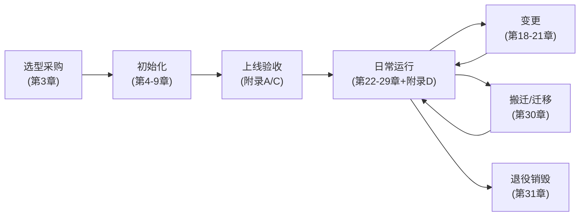

# 09 服务器全生命周期运维大全

> 单文件自包含的服务器运维总纲：一台 Linux 服务器从选型采购到退役销毁的**全部事项**，
> 覆盖安全、执行、编排、治理四大面。凡涉及技术选型，给出选项对比与推荐结论，不绑定特定环境。
> 优先级标注：**P0** = 不达标就是事故隐患，限期整改；**P1** = 应该有，排期整改；**P2** = 加分项。

## 目录

- **第一部分 总纲与生命周期**：1 文档定位 / 2 生命周期总览 / 3 硬件与实例层
- **第二部分 系统与存储基线**：4 操作系统基线 / 5 存储与文件系统 / 6 软件源与依赖 / 7 资产与标识
- **第三部分 网络与安全**：8 网络架构 / 9 账号与访问 / 10 网络暴露面 / 11 入口层安全 / 12 深度加固 / 13 凭证与密钥 / 14 安全事件响应
- **第四部分 执行与编排**：15 服务部署规范 / 16 容器与编排 / 17 数据库与中间件 / 18 配置管理与 IaC / 19 CI/CD 与制品 / 20 变更管理与发布 / 21 定时任务治理
- **第五部分 可观测与韧性**：22 日志管理 / 23 监控与告警 / 24 链路追踪与 APM / 25 性能调优与容量规划 / 26 高可用架构 / 27 备份与容灾 / 28 补丁与漏洞管理 / 29 故障应急响应
- **第六部分 治理与协作**：30 环境隔离、多机管理与数据迁移 / 31 成本容量治理、协作流程与退役下线
- **附录**：A 全量验收清单汇总 / B 常用命令速查（双发行版） / C 新机上线时序表 / D 运维日历

---

# 第一部分：总纲与生命周期

## 1. 文档定位与使用方式

### 1.1 适用对象与场景

- **接手一台陌生服务器**：按附录 A 清单摸底，输出达标/不达标/不适用三态结果
- **新服务器上线**：按附录 C 的 Day-0/Day-1/Day-7 时序表逐步执行
- **日常运营**：按附录 D 运维日历执行例行事项
- **单项工作**（如配置备份、加固 SSH）：直接查对应章节
- **技术选型**（如选编排方案、选监控栈）：查对应章节的选型对比表

### 1.2 使用原则

1. **P0 是底线**：任何一台承载生产业务的机器，P0 项不全过不算合格
2. **选型章节先看结论**：每个选型表后有推荐结论与适用条件，先对号入座再细读
3. **命令有发行版差异的均给双版本**：Debian/Ubuntu 系（apt）与 RHEL 系（dnf）对照
4. **本文自包含**：不依赖其他文档即可执行；与仓库内 00-08 分域规范并存，摸底验收以本文附录 A 为准

### 1.3 有意不展开的边界

以下事项属其他领域，本文只在相关处一句话提及去处，不展开：

- 应用代码层面的开发规范（研发域）
- 具体业务的容量数值（依业务而定，本文只给评估方法）
- 等保/ISO 27001 等合规认证的**申报流程**（第 12 章仅覆盖对应技术项）
- Windows Server（本文面向 Linux）
- 机房基础设施：供电、制冷、布线（IDC 域，云上用户不可见）

## 2. 服务器生命周期总览

### 2.1 七个阶段



| 阶段 | 核心问题 | 关键动作 |
|------|---------|---------|
| 选型采购 | 买什么、放哪里、怎么计费 | 规格评估、可用区规划、计费模式决策 |
| 初始化 | 从裸机到可托管生产 | 系统基线、存储规划、账号、防火墙、监控接入 |
| 上线验收 | 有没有达到底线 | 附录 A 逐项打勾，P0 全过才承载业务 |
| 日常运行 | 保持健康、及时发现异常 | 巡检、补丁、备份验证、告警响应 |
| 变更 | 不因变更引发事故 | 审批、窗口、灰度、验证、可回滚 |
| 搬迁/迁移 | 换机器/换云不中断业务 | 预同步、割接窗口、回切预案 |
| 退役销毁 | 不留数据、不留监控噪音、不留台账垃圾 | 数据归档、凭证回收、台账注销 |

### 2.2 规模演进：管理方式随台数变化

| 规模 | 管理方式 | 必须升级的能力 |
|------|---------|--------------|
| 1-5 台 | 手工 + Git 记录配置，SSH 直连 | 台账、备份、基础监控（这三样再小也不能省） |
| 5-20 台 | Ansible 批量管理，集中日志 | 配置代码化、堡垒机或统一入口、告警分级 |
| 20-100 台 | IaC 全覆盖（Terraform+Ansible），编排平台 | 环境隔离成体系、CMDB 化台账、值班制度 |
| 100 台+ | 平台化自助，SRE 团队 | 超出本文范围，需要专职平台工程 |

**判断标准**：当"逐台手工操作"的时间开始超过"写自动化"的时间，就是升级时机。不要在 3 台机器时上 K8s，也不要在 30 台机器时还在逐台 SSH 改配置。

## 3. 硬件与实例层

### 3.1 形态选型

| 维度 | 物理机（自购/托管） | 自建虚拟化（KVM/Proxmox） | 云实例 |
|------|-------------------|--------------------------|--------|
| 前期投入 | 高（整机采购） | 高（宿主机+运维能力） | 低（按需开通） |
| 弹性 | 无 | 有限（受宿主容量限制） | 分钟级扩缩 |
| 硬件运维 | 全自担（含硬盘更换、带外） | 全自担 | 云厂商承担 |
| 性能 | 独占、可预期 | 接近物理机 | 有虚拟化损耗、邻居噪音（共享型） |
| 适用 | 稳定大流量、有 IDC 资源、合规要求数据不出机房 | 已有物理机想切分资源、内部测试云 | 绝大多数场景的默认选择 |

**推荐结论**：无特殊合规或成本约束时默认云实例；长期稳定的大规格负载可用包年物理机/独享型实例压成本；自建虚拟化仅在已有物理机资产时考虑，首选 Proxmox VE（开源、Web 管理、集群与备份内置），纯命令行场景用 KVM + libvirt。

### 3.2 云实例规格评估

- **CPU 内存比**：Web/API 服务 1:2（如 4c8g）起步；缓存/数据库 1:4 或 1:8；计算密集 1:1
- **突发性能实例（t 系列）陷阱**：CPU 积分耗尽后被限制在基线（如 20%），压测或流量高峰时性能悬崖。**只用于低负载常驻服务，生产核心服务用标准型**
- **本地盘 vs 云盘**：本地 NVMe 快但**宿主机故障数据即丢**，只放可重建数据（缓存、临时计算）；系统盘和数据盘默认云盘（SSD/ESSD 级别按 IOPS 需求选）
- **代际选择**：同价位选新代际（性能/价格比更优），避免使用已停售代际（后续无法同规格扩容）
- 规格评估先看**实际负载数据**（已有系统看监控峰值 ×1.5 冗余），没有数据时从小规格起步 + 快速升配路径，不要拍脑袋买大

### 3.3 可用区与放置策略

- P0 同一业务的**主备/多副本不放同一可用区**（AZ 级故障是真实发生的）
- 有内网互调的服务优先同 AZ（跨 AZ 延迟 1-3ms 且部分厂商收跨 AZ 流量费），在"容灾"与"延迟/成本"间明确取舍并记录
- 物理机放置：云上多台同角色机器用**部署集/置放群组**打散宿主机，避免一台宿主机故障带走整个集群

### 3.4 计费模式

| 模式 | 适用 | 风险点 |
|------|------|--------|
| 包年包月 | 长期稳定负载（>6 个月确定使用） | 到期不续费即停机释放；退订有损失 |
| 按量付费 | 短期、弹性、测试 | 单价最高（约为包月的 2-3 倍）；欠费停机 |
| 抢占式/竞价 | 可中断的批处理、无状态可重建节点 | 随时可能被回收，**绝不放有状态服务** |
| 预留券/节省计划 | 按量机器的长期折扣 | 承诺期内用量不足则浪费 |

- P0 每台机器的**到期时间与续费方式**（自动续费/手动/不续）登记台账并有到期前告警
- P1 计费模式变更（按量转包月等）纳入月度成本 review（见第 31 章）

### 3.5 带外管理与硬件健康（物理机）

- 物理机必须配置带外管理（IPMI/iDRAC/iLO）：系统失联时仍可远程控制台、重启、装机。带外口**只接管理网**，绝不暴露公网（历史 CVE 极多）
- 硬盘健康：`smartctl -a /dev/sda`（smartmontools）定期巡检 + `smartd` 常驻告警；RAID 阵列用厂商工具（`storcli`/`perccli`）监控降级状态，**RAID 降级告警必须当天响应**——第二块盘坏掉就是数据丢失
- 内存 ECC 错误：`ras-mc-ctl --error-count`（rasdaemon），可纠正错误持续增长是换内存信号
- 云实例硬件层不可见，替代动作：**订阅云厂商的实例维护/故障事件通知**（控制台消息中心 + 事件 API），宿主机维护事件提前迁移

### 3.6 GPU/异构硬件要点

- 驱动与 CUDA 版本**锁定并记录台账**：驱动升级是变更（第 20 章流程），CUDA/驱动/框架三者有兼容矩阵，盲升会导致业务起不来
- `nvidia-smi` 接入监控：显存、利用率、**温度与功耗**（过热降频是隐蔽的性能故障）
- `nvidia-persistenced` 常驻（persistence mode）避免首次调用延迟
- 容器用 GPU：安装 nvidia-container-toolkit，K8s 用 device plugin；GPU 不支持超卖，容量规划按卡数硬分配

### 3.7 本章清单

- [ ] P0 主备/多副本跨可用区部署
- [ ] P0 到期时间、计费方式登记台账并有到期告警
- [ ] P0 抢占式实例上没有有状态服务
- [ ] P0 物理机带外口不暴露公网
- [ ] P1 生产核心服务不使用突发性能实例
- [ ] P1 物理机 SMART/RAID/ECC 监控接入告警；云实例订阅维护事件通知
- [ ] P1 GPU 机器驱动/CUDA 版本入台账，nvidia-smi 指标接入监控
- [ ] P2 同角色多机使用部署集打散宿主机
- [ ] P2 长期负载评估预留券/节省计划

---

# 第二部分：系统与存储基线

## 4. 操作系统基线

### 4.1 发行版选型

| 维度 | Ubuntu LTS | Debian | RHEL 系（Rocky/Alma/Anolis） |
|------|-----------|--------|------------------------------|
| 支持周期 | 5 年（LTS），可延长 | 约 5 年 | 10 年 |
| 软件新鲜度 | 较新 | 保守稳定 | 保守，企业补丁质量高 |
| 社区资料 | 最多 | 多 | 多（偏企业） |
| 包管理 | apt | apt | dnf |
| 典型场景 | 通用默认、容器宿主 | 追求极简稳定 | 企业软件兼容（Oracle 等）、超长周期 |

**推荐结论**：无历史包袱时统一 Ubuntu LTS（偶数年 4 月版本），全团队**只用一个发行版**的价值大于发行版之间的差异——脚本、基线、经验全部可复用。存量混合环境（如 Ubuntu + CentOS）：不强行迁移，但新机器统一到主发行版，存量在大版本 EOL 时借重装收敛。

- P0 **不跑 EOL 系统**（CentOS 7/8 已 EOL；Ubuntu 查 `ubuntu.com/about/release-cycle`）。存量 EOL 机器登记台账、限期迁移

### 4.2 装机后立即执行的基线

**时区与时间同步**（时间不同步 = 日志无法对齐、证书校验失败、分布式系统错乱）：

```bash
timedatectl set-timezone UTC          # 全部机器统一 UTC，应用层再做本地化展示
# 时间同步：确认 synchronized: yes
timedatectl
```

时间同步组件选型：`systemd-timesyncd`（默认、够用）vs `chrony`（更精准、支持做内网时间源）。数据库/分布式存储机器用 chrony：

```bash
apt install -y chrony    # Debian/Ubuntu，配置 /etc/chrony/chrony.conf
dnf install -y chrony    # RHEL 系，配置 /etc/chrony.conf
# 云上优先用厂商内网 NTP 源（阿里 ntp.cloud.aliyuncs.com / 腾讯 ntpupdate.tencentyun.com），延迟低且不占公网带宽
chronyc tracking         # 验证偏移量
```

**主机名与 hosts**：

```bash
hostnamectl set-hostname prod-web-01   # 与台账、云控制台名称三处一致
echo "127.0.1.1 prod-web-01" >> /etc/hosts   # 避免 sudo 等工具反查慢
```

**locale**：统一 `en_US.UTF-8`（日志避免中文乱码，工具兼容性最好）。

### 4.3 内核参数基线

写入 `/etc/sysctl.d/99-ops-baseline.conf`（不直接改 sysctl.conf，分文件便于管理）：

```bash
# 网络基线
net.ipv4.tcp_syncookies = 1            # SYN flood 基础防护
net.core.somaxconn = 1024              # accept 队列上限，配合应用 backlog
net.ipv4.tcp_max_syn_backlog = 2048
net.ipv4.ip_local_port_range = 10240 65000   # 出向连接端口范围
net.ipv4.tcp_tw_reuse = 1              # 复用 TIME_WAIT（仅出向安全）
# 注意：tcp_tw_recycle 已在 4.12+ 内核移除，任何文档教你开它都是过时的

# 内存
vm.swappiness = 10                     # 有 swap 时尽量少用
vm.max_map_count = 262144              # ES/ClickHouse 等需要，通用调高无害

# 文件句柄
fs.file-max = 1048576

# 安全
net.ipv4.conf.all.rp_filter = 1        # 反向路径校验，防源地址伪造
net.ipv4.conf.all.accept_redirects = 0
net.ipv4.conf.all.send_redirects = 0
kernel.dmesg_restrict = 1              # 普通用户不可读内核日志
```

```bash
sysctl --system   # 应用并验证
```

更深的 TCP 调优（buffer、拥塞控制 BBR 等）见第 25 章——**先有监控证据再调，不盲抄参数**。

### 4.4 swap 策略

有无 swap 都是**决策**，不是默认值：

| 场景 | 建议 |
|------|------|
| 通用应用服务器（≥8G 内存） | 不配 swap：宁可 OOM 杀进程被监控发现并自动重启，不要 swap 拖慢整机且掩盖内存不足 |
| 小内存机器（≤4G） | 配 2G swap 作缓冲，同时必须有内存告警 |
| 数据库专用机 | 不配 swap 或 swappiness=1，数据库自身管理内存 |
| Kubernetes 节点 | 必须关（kubelet 默认要求）：`swapoff -a` 并注释 fstab 条目 |

### 4.5 journald 与 core dump

**journald 上限**（默认可膨胀到磁盘 10%，必须设上限）：

```bash
mkdir -p /etc/systemd/journald.conf.d
cat > /etc/systemd/journald.conf.d/size.conf <<'EOF'
[Journal]
SystemMaxUse=500M
MaxRetentionSec=14day
EOF
systemctl restart systemd-journald
```

**core dump 管理**（默认行为不明确 = 磁盘被巨型 core 文件撑爆，或想调试时没有 core）：

```bash
# 推荐交给 systemd-coredump 统一管理（自动压缩、限额、journal 索引）
cat > /etc/sysctl.d/50-coredump.conf <<'EOF'
kernel.core_pattern = |/usr/lib/systemd/systemd-coredump %P %u %g %s %t %c %h
EOF
# /etc/systemd/coredump.conf 中设 ProcessSizeMax=2G, MaxUse=5G
coredumpctl list   # 查看，coredumpctl gdb <pid> 调试
```

**kdump**（内核崩溃转储）：物理机/自建虚拟化宿主机建议开启（排查内核级问题的唯一证据）；云实例默认不开——内核崩溃概率低且占用 crashkernel 内存，除非正在追查内核问题。

### 4.6 目录规划约定

- 数据、日志、应用三分离：`/data`（业务数据）、`/var/log/<服务名>`（日志）、`/opt/apps` 或 `/opt/compose`（应用）
- 运维仓库统一克隆到 `/opt/ops`，与 Git 远程保持同步
- 禁止在 `/root`、`/home` 下散落服务和数据

### 4.7 双发行版差异速记

| 事项 | Debian/Ubuntu | RHEL 系 |
|------|--------------|---------|
| 包管理 | apt / dpkg | dnf / rpm |
| 防火墙默认 | ufw | firewalld |
| 网络配置 | netplan（Ubuntu）/ interfaces | NetworkManager（nmcli） |
| SELinux/AppArmor | AppArmor | SELinux |
| 自动安全更新 | unattended-upgrades | dnf-automatic |
| sed -i 差异 | GNU sed | GNU sed（macOS 才是 BSD sed，需 `sed -i ''`） |

### 4.8 本章清单

- [ ] P0 时区 UTC，时间同步 synchronized: yes
- [ ] P0 不跑 EOL 系统；EOL 存量登记并限期迁移
- [ ] P0 数据/日志/应用三分离目录规划
- [ ] P1 内核参数基线文件已应用（/etc/sysctl.d/99-ops-baseline.conf）
- [ ] P1 journald 有上限（SystemMaxUse）
- [ ] P1 swap 策略是明确决策并记录（K8s 节点必须关）
- [ ] P1 core dump 行为明确（systemd-coredump + 限额）
- [ ] P2 数据库/分布式机器用 chrony 并指向云内网时间源
- [ ] P2 物理机开启 kdump

## 5. 存储与文件系统

### 5.1 分区与挂载规划

- 系统盘与数据盘**物理分离**（两块盘）：系统盘 40-60G 够用；业务数据全部在数据盘 `/data`。价值：重装系统不动数据、扩容互不影响、快照策略可分开
- fstab 用 UUID 而非设备名（`/dev/vdb` 顺序可能漂移），云盘加 `nofail`（盘异常时系统仍能启动，否则卡在紧急模式连 SSH 都上不去）：

```bash
blkid /dev/vdb1   # 取 UUID
# /etc/fstab
UUID=xxxx-xxxx /data xfs defaults,nofail 0 2
mount -a && findmnt /data   # 验证挂载，mount -a 无报错才算 fstab 正确
```

- `noatime`：读密集场景（大量小文件）可加，减少元数据写；一般场景默认 `relatime` 已足够

### 5.2 LVM：是否使用

| | 直接分区 | LVM |
|---|---------|-----|
| 扩容 | 依赖分区表操作 | `lvextend` 在线扩，最灵活 |
| 复杂度 | 低 | 中（多一层概念） |
| 快照 | 无 | 有（但性能差，不作为备份手段） |

**推荐结论**：物理机数据盘用 LVM（扩容靠加盘）；云盘可以不用——云盘本身支持在线扩容（见 5.4），多一层 LVM 反而增加排障复杂度。已用 LVM 的存量照常维护：

```bash
# LVM 扩容三步（加了新盘 /dev/sdc 的场景）
pvcreate /dev/sdc && vgextend vg_data /dev/sdc
lvextend -r -L +100G /dev/vg_data/lv_data   # -r 同时扩文件系统
```

### 5.3 文件系统选型

| | ext4 | xfs |
|---|------|-----|
| 成熟度 | 极高 | 极高（RHEL 默认） |
| 大文件/并行 IO | 良 | 优 |
| 缩容 | 支持（离线） | **不支持缩容** |
| inode | 格式化时固定 | 动态分配（基本不会耗尽） |

**推荐结论**：数据库/大文件/日志盘用 xfs；系统盘随发行版默认即可。记住 xfs 不能缩容——规划时宁小勿大，反正能在线扩。

### 5.4 磁盘扩容实操（云盘，最高频操作之一）

```bash
# 1. 控制台/CLI 扩容云盘容量（在线，不停机）
# 2. 扩分区（growpart 属 cloud-guest-utils / cloud-utils-growpart 包）
growpart /dev/vdb 1
# 3. 扩文件系统
resize2fs /dev/vdb1      # ext4
xfs_growfs /data         # xfs（传挂载点而非设备）
df -h /data              # 验证
```

- 扩容前 `lsblk` 确认盘符与分区结构，别扩错盘
- **缩容没有在线方案**：只能新建小盘 + 数据迁移，所以容量规划从小起步逐步扩

### 5.5 inode 治理

- 磁盘告警必须同时监控**容量与 inode**：`df -h` 和 `df -i`。海量小文件（会话文件、缓存分片、邮件队列）会在容量只用 30% 时耗尽 inode，症状同样是 "No space left on device"
- 定位大量小文件目录：`du --inodes -d3 /data | sort -rn | head -20`（RHEL 老版本无 `--inodes` 用 `find /data -xdev -printf '%h\n' | sort | uniq -c | sort -rn | head`）
- 根治：产生小文件的应用改用数据库/对象存储，或定期清理任务（第 21 章规范）

### 5.6 云盘快照策略

- P1 系统盘：开启自动快照策略（每日一次、保留 7 天）——回滚系统级误操作的最后手段
- 数据盘：快照是**崩溃一致性**的（不保证应用/数据库一致），可作为"卷级恢复"补充，**不能替代逻辑备份**（第 27 章）；数据库盘打快照前有条件的先 `FLUSH TABLES WITH READ LOCK` 或用云厂商的应用一致性快照
- 快照也是成本：保留数量要有上限，僵尸快照纳入月度成本清理（第 31 章）

### 5.7 共享存储

| 选项 | 适用 | 陷阱 |
|------|------|------|
| NFS（云 NAS / 自建） | 多机共享读写同一目录（传统应用改不动时） | 服务端故障时客户端 hang 死（挂载加 `soft,timeo=100` 或用 `hard,intr` 权衡）；锁语义弱；性能天花板低 |
| 对象存储挂载（ossfs/cosfs/s3fs） | 只读或低频写的文件访问 | **不是 POSIX 文件系统**：随机写、rename、追加语义都不可靠，高频读写必炸 |
| 对象存储 SDK 直连 | 新应用的文件存取 | 无陷阱，就是要改代码 |

**推荐结论**：新应用一律 SDK 直连对象存储；NFS 只作为存量应用的过渡方案且必须监控服务端；把 ossfs/cosfs 当成"方便浏览的只读视图"而不是数据盘。

### 5.8 本章清单

- [ ] P0 系统盘与数据盘分离，业务数据在 /data
- [ ] P0 fstab 用 UUID 且云盘带 nofail，mount -a 验证通过
- [ ] P0 磁盘监控同时覆盖容量与 inode
- [ ] P1 系统盘自动快照开启（日快照、保留 7 天）
- [ ] P1 数据库盘明确"快照不替代逻辑备份"，逻辑备份已配置（第 27 章）
- [ ] P1 NFS 挂载参数明确 soft/hard 决策，服务端有监控
- [ ] P2 数据盘文件系统选型有记录（xfs 不可缩容已知晓）
- [ ] P2 快照保留数量有上限并纳入成本 review

## 6. 软件源与依赖管理

### 6.1 源规范

- 源配置**统一且入 Git**：国内机器用镜像源（阿里/腾讯/清华），海外机器用官方源；同一环境所有机器源一致（否则"同样的安装命令装出不同版本"）
- 换源后立即 `apt update` / `dnf makecache` 验证可用
- **禁止** `curl <url> | bash` 安装任何东西：看不到脚本内容、不可审计、不可回滚。替代：下载脚本 → 审阅 → 入 Git → 执行

### 6.2 第三方源风险控制

- 每个第三方源独立文件：`/etc/apt/sources.list.d/<名称>.list` / `/etc/yum.repos.d/<名称>.repo`，来源和用途写注释
- GPG key 验证：apt 用 `signed-by=` 指向专用 keyring（不再用全局 apt-key，已废弃）；dnf 确认 `gpgcheck=1`
- 第三方源的包**锁定来源**：apt 用 pin priority 防止第三方源覆盖系统包；能用官方源/容器镜像解决的不加第三方源

### 6.3 版本锁定

关键组件（docker、数据库客户端、内核）防止意外升级：

```bash
apt-mark hold docker-ce           # Debian/Ubuntu；解除 unhold
dnf install python3-dnf-plugin-versionlock && dnf versionlock add docker-ce   # RHEL 系
```

锁定即负债：登记台账（锁了什么、为什么、何时评估解锁），否则安全更新也被挡住。

### 6.4 语言运行时管理

| 方式 | 适用 | 问题 |
|------|------|------|
| 系统包（apt/dnf 装 python3 等） | 系统工具依赖 | 版本老旧且不能多版本共存 |
| 版本管理器（nvm/pyenv/sdkman） | 开发机、构建机 | 生产机上是隐式状态，重装难复现 |
| 容器化 | 生产运行时 | 无，就是要容器化 |

**推荐结论**：生产业务的运行时版本进 Dockerfile（容器化，版本即代码）；裸跑的存量服务把运行时版本记入台账。**不在生产机上用版本管理器现装运行时**。

### 6.5 本章清单

- [ ] P0 无 curl | bash 安装痕迹；安装脚本审阅后入 Git
- [ ] P0 第三方源均有独立文件 + GPG 验证 + 用途注释
- [ ] P1 同环境机器源配置一致且入 Git
- [ ] P1 关键组件版本锁定并登记（含解锁评估时间）
- [ ] P1 生产运行时版本容器化或入台账
- [ ] P2 定期（季度）审计源列表，清理不再使用的源

## 7. 资产与标识

### 7.1 命名规范

格式：`<环境>-<角色>-<序号>`，如 `prod-web-01`、`test-db-02`。

- 环境：prod / test / stage（预发）
- 角色用通用词：web、api、db、cache、mq、lb、bastion、monitor、ci
- **三处一致**：hostname、云控制台实例名、台账条目名。任何一处改名，三处同步

### 7.2 台账字段（每台机器必填）

```yaml
# inventory/servers.yaml 条目示例
prod-web-01:
  ip_private: 10.0.1.10
  ip_public: 203.0.113.10        # 无公网写 none
  cloud: aliyun                   # aliyun / tencent / idc
  region: cn-hangzhou
  az: cn-hangzhou-h
  os: ubuntu-22.04
  spec: 4c8g-100g
  role: web
  services: [nginx, app-frontend]
  owner: zhangsan
  expire: 2027-03-01              # 到期日
  billing: prepaid                # prepaid包月 / postpaid按量
  notes: "2026-07 迁自 old-web-03"
```

### 7.3 云标签

云控制台资源打统一标签（用于账单分摊与批量筛选）：`env` / `role` / `project` / `owner` 四个必打。标签是云上的"结构化台账"，与 Git 台账互为校验——**定期用 CLI 拉取实例列表与台账比对**，发现"台账外机器"（最危险的资产：没人管、没监控、没备份）。

### 7.4 到期与计费

- P0 包月实例到期告警：提前 14 天（云消息中心 + 自建监控双通道）。**欠费/到期停机是最愚蠢也最常见的生产事故**
- 自动续费策略明确记录：核心生产机开自动续费；测试机明确到期即释放
- 账号余额告警（按量实例的欠费风险在账号层）

### 7.5 本章清单

- [ ] P0 主机名符合规范且三处一致
- [ ] P0 台账字段完整（含到期日、计费方式、owner）
- [ ] P0 到期/欠费告警双通道覆盖
- [ ] P1 云标签四件套（env/role/project/owner）全覆盖
- [ ] P1 每季度 CLI 拉取实例列表与台账比对，无台账外机器
- [ ] P2 说不清用途的机器：隔离观察一个月无人报障后走退役流程（第 31 章）

---

# 第三部分：网络与安全

## 8. 网络架构

### 8.1 VPC 与子网规划

- **按环境分 VPC**（prod 一个、test 一个）是默认做法：环境级硬隔离，测试事故波及不到生产。同 VPC 内再按业务/层次分子网（web 层、数据层分开）
- **网段规划一次做对**：各 VPC 网段不重叠、也避开常见家用段（192.168.0.0/16）和办公网段。网段冲突的代价在后期做对等连接/VPN 时才爆发，且几乎无法修复只能重建
- 规划示例：prod 用 10.0.0.0/16（web 10.0.1.0/24、db 10.0.2.0/24），test 用 10.1.0.0/16，办公 VPN 172.16.0.0/16

### 8.2 内网互通选项

| 选项 | 适用 | 成本/限制 |
|------|------|----------|
| VPC 对等连接 | 同云两个 VPC 互通 | 免费或低价；网段不能重叠 |
| 云联网/传输网关 | 多 VPC、多地域组网 | 按流量计费；管理集中 |
| VPN 网关（IPsec） | 跨云互通、办公网到云 | 走公网、延迟抖动；加密开销 |
| 专线 | 跨云/IDC 大流量低延迟 | 贵、开通周期长 |
| WireGuard 自建 | 轻量跨云、点对点 | 自运维；性能好配置简单，推荐小规模跨云 |

**推荐结论**：同云用对等/云联网；小规模跨云用 WireGuard 自建隧道；流量大或 SLA 敏感再上专线。所有互通关系画一张拓扑图入库——**说不清"哪些网能通哪些网"的架构必然出安全事故**。

### 8.3 出网与入网管控

- **出网**：需要固定出口 IP（对外 API 白名单）的场景用 NAT 网关或绑定 EIP 的代理机；内网机器**默认无公网**，出网统一走 NAT——好处是出口可控可审计，坏处是 NAT 网关是单点要监控
- **入网**：公网入口收敛到最少数量的机器（LB/网关/堡垒机），其余机器一律纯内网。"每台机器都有公网 IP"是小作坊做法，攻击面成倍放大
- EIP 治理：闲置 EIP 收费且是资产泄露点，纳入月度清理

### 8.4 内网 DNS

| 选项 | 适用 |
|------|------|
| 云私有域（PrivateZone/Private DNS） | 默认推荐：免运维，控制台/API 管理 |
| 自建 dnsmasq/CoreDNS | 混合云统一视图、需要复杂解析逻辑 |
| /etc/hosts 分发 | ≤5 台的过渡方案，用 Ansible 统一分发，禁止手工逐台改 |

内网服务一律用域名调用（`db.prod.internal`），不硬编码 IP——迁移换 IP 时只改 DNS 一处。

### 8.5 IPv6

- 明确决策：暂不启用（默认）或双栈。**不启用不等于不管**：云实例若默认带了 IPv6 地址，安全组/防火墙规则必须同样覆盖 v6（只配 v4 规则 = v6 裸奔），不用就在实例层关闭
- 启用双栈的触发条件：App Store 审核要求、运营商 v6 考核、海外业务

### 8.6 本章清单

- [ ] P0 prod/test 环境 VPC 隔离
- [ ] P0 公网入口收敛：仅 LB/网关/堡垒机有公网，其余机器纯内网
- [ ] P0 IPv6 要么明确启用并配全规则，要么实例层关闭
- [ ] P1 VPC 网段规划无重叠且有文档
- [ ] P1 内网服务走内网 DNS 域名，不硬编码 IP
- [ ] P1 网络拓扑图（VPC、子网、互通关系、出入口）入库并保持更新
- [ ] P2 NAT 网关/出口代理有监控
- [ ] P2 闲置 EIP 月度清理

## 9. 账号与访问（机器层 + 云平台层）

### 9.1 SSH 加固（机器层第一道门）

`/etc/ssh/sshd_config.d/99-hardening.conf`（分文件管理，发行版升级不冲突）：

```bash
PermitRootLogin no                 # 禁 root 直登；存量 root 登录先记录、排期整改
PasswordAuthentication no          # 只允许密钥
PubkeyAuthentication yes
MaxAuthTries 3
LoginGraceTime 30
ClientAliveInterval 300            # 空闲超时
ClientAliveCountMax 2
AllowGroups ssh-users              # 白名单组：不在组里连认证机会都没有
X11Forwarding no
```

```bash
sshd -t && systemctl reload sshd   # 语法校验通过才 reload；改 SSH 配置时保留当前会话直到新会话验证成功
```

- 端口：改非 22 端口只能减少扫描噪音，不是安全措施，真正的防线是密钥 + 来源限制（安全组限 IP 或堡垒机）
- 密钥算法统一 ed25519（短、快、无已知弱点）：`ssh-keygen -t ed25519 -C "user@purpose"`

### 9.2 个人账号与 sudo

- **一人一账号**，加入 `ssh-users` 组；禁止共用账号（出了事查不到人）
- sudo 分级：管理员全量 sudo；排障人员只读白名单：

```bash
# visudo -f /etc/sudoers.d/ops-readonly   （必须用 visudo，语法错会锁死所有 sudo）
%ops-ro ALL=(ALL) NOPASSWD: /usr/bin/journalctl, /usr/bin/systemctl status *, /usr/bin/docker ps, /usr/bin/docker logs *
```

- 密钥生命周期：入职发放（用户自己生成，只交公钥）→ 季度审计所有机器 `authorized_keys`（每把 key 都能对应到在职的人）→ 离职当日回收（第 31 章）

### 9.3 访问路径选型

| 选项 | 适用 | 要点 |
|------|------|------|
| 直连 + 安全组限源 IP | ≤5 人、≤10 台 | 办公网固定 IP 或个人 VPN；安全组只放行这些源 |
| 堡垒机（JumpServer/Teleport） | 多人多机、需审计回放 | 所有 SSH 必经堡垒机，机器安全组只信任堡垒机 IP；堡垒机自身要 MFA + 重点加固 |
| 云助手/Session Manager | 免公网端口的补充通道 | 机器可完全不开 22 公网；依赖云平台可用性，作为主通道或逃生通道均可 |

**推荐结论**：规模小用直连+限源起步；超过 5 人或有审计合规要求上堡垒机；无论哪种，**保留一条独立逃生通道**（云控制台 VNC/云助手），防止把自己锁在门外。

### 9.4 操作留痕（机器层）

- history 加时间戳并防清空只是基础纪律，不是审计（用户可绕过）：

```bash
echo 'export HISTTIMEFORMAT="%F %T "' > /etc/profile.d/history.sh
```

- 真审计：堡垒机会话录像，或 auditd 记录 execve（第 12 章），二选一必有其一（P1）

### 9.5 云平台账号治理（比机器层更大的攻击面）

拿到云账号 ≈ 拿到所有机器 + 所有数据 + 备份删除权。管控优先级高于任何单机加固：

- P0 **主账号（root account）开 MFA，且不用于日常操作**——只用于账务和授权管理
- P0 每人独立子账号（RAM/CAM），按最小权限授权；**程序用的 AccessKey 挂在专用子账号上**（权限只够干那一件事），绝不创建主账号 AK
- P0 高危权限（释放实例、删除备份、改安全组）单独收敛：日常子账号没有这些权限，需要时临时授权或走审批
- P1 AK 轮换：登记每个 AK 的用途和创建时间，年度轮换；**AK 泄露应急**：立即禁用 → 创建新 AK 替换 → 审计云审计日志（ActionTrail/CloudAudit）看泄露期间做了什么 → 复盘泄露渠道
- P1 开启云审计日志全量投递（谁在什么时候用什么身份做了什么云操作），保留 ≥180 天
- P2 生产/测试分云账号（规模大时的终极隔离，账单也天然分开）

### 9.6 本章清单

- [ ] P0 SSH：禁密码、禁 root 直登、AllowGroups 白名单、authorized_keys 无来路不明的 key
- [ ] P0 一人一账号一密钥（ed25519），无共用账号
- [ ] P0 云主账号 MFA + 不日常使用；无主账号 AK
- [ ] P0 程序 AK 挂最小权限专用子账号
- [ ] P1 sudo 分级（排障组只读白名单）
- [ ] P1 有独立逃生通道（云助手/VNC）且验证过可用
- [ ] P1 操作审计：堡垒机录像或 auditd execve 至少其一
- [ ] P1 云审计日志开启且保留 ≥180 天；AK 有台账和轮换计划
- [ ] P2 季度审计 authorized_keys 与云子账号权限
- [ ] P2 生产/测试分云账号

## 10. 网络暴露面

### 10.1 原则

1. **默认拒绝，白名单放行**：先关全部，再逐个开有理由的
2. 每个对公网开放的端口都能回答：**为什么开、给谁用、登记在哪**——回答不了的立即关
3. **纵深两层**：云安全组（第一层，实例外）+ 主机防火墙（第二层，实例内）。只依赖安全组的问题：一次误操作/一个过宽规则就全裸；只依赖主机防火墙的问题：容器可能绕过它（见 10.4）

### 10.2 防火墙选型

| 选项 | 适用 | 说明 |
|------|------|------|
| ufw | Ubuntu/Debian，规则简单 | iptables 前端，语法人性化，推荐默认 |
| firewalld | RHEL 系 | zone 概念，nmcli 生态集成 |
| nftables 原生 | 规则复杂、追求性能 | 上面两者的底层，直接写适合专业场景 |
| 仅云安全组 | 不推荐单用 | 少一层纵深；K8s 节点是例外（网络策略由 CNI 管） |

```bash
# ufw（Debian/Ubuntu）
ufw default deny incoming && ufw default allow outgoing
ufw allow from 203.0.113.0/24 to any port 22 proto tcp   # SSH 限源
ufw allow 80/tcp && ufw allow 443/tcp                     # 仅入口机器
ufw allow from 10.0.0.0/16 to any port 9100 proto tcp    # exporter 仅内网
ufw enable && ufw status verbose

# firewalld（RHEL 系）
firewall-cmd --permanent --add-rich-rule='rule family=ipv4 source address=203.0.113.0/24 port port=22 protocol=tcp accept'
firewall-cmd --permanent --add-service=https
firewall-cmd --reload && firewall-cmd --list-all
```

改防火墙的**保命纪律**：先加放行再收紧默认；改 SSH 相关规则时保持当前会话在线，新开会话验证成功后才断开。

### 10.3 数据面纪律

- P0 数据库/缓存/内部组件（3306/5432/6379/9200/9100/2379 等）**绝不监听公网**：应用配置 `bind 内网IP`，防火墙双层限内网来源。公网 Redis 裸奔 = 分钟级被入侵（自动化扫描 + 写 crontab 提权是成熟产业链）
- 服务监听地址显式配置：能 bind 127.0.0.1 的（本机才用）就不 bind 0.0.0.0

### 10.4 Docker 与防火墙的著名陷阱

Docker 默认直接操作 iptables，`-p 6379:6379` 发布的端口**绕过 ufw/firewalld 规则直通公网**。对策（选其一）：

1. 发布端口时显式绑内网/本机：`-p 127.0.0.1:6379:6379`（推荐，简单可靠）
2. daemon.json 设 `"iptables": false`（副作用大，需自管转发，不推荐）
3. 配置 DOCKER-USER 链统一限制来源

### 10.5 fail2ban 与端口审计

```bash
apt install -y fail2ban   # dnf install -y fail2ban
cat > /etc/fail2ban/jail.local <<'EOF'
[sshd]
enabled = true
maxretry = 5
findtime = 10m
bantime = 1h
EOF
systemctl enable --now fail2ban && fail2ban-client status sshd
```

- 月度端口审计：`ss -tlnp` 全量列出监听，逐个对照台账，多出来的查清来源（附录 D 例行项）

### 10.6 本章清单

- [ ] P0 双层防线：安全组 + 主机防火墙，默认拒绝入站
- [ ] P0 安全组无 0.0.0.0/0 全端口放行；每个公网端口有登记
- [ ] P0 数据库/缓存/exporter 不暴露公网
- [ ] P0 Docker 发布端口显式绑定内网/127.0.0.1（陷阱已处理）
- [ ] P1 SSH 来源受限（安全组限源或堡垒机）
- [ ] P1 fail2ban 运行中
- [ ] P1 月度 ss -tlnp 端口审计对照台账
- [ ] P2 清理历史遗留防火墙规则（每条规则有注释说明用途）

## 11. 入口层安全

### 11.1 域名与 DNS 管理

- 域名台账：注册商、到期日（**自动续费开启 + 到期告警**，域名过期比服务器宕机更致命——可能被抢注）、DNS 托管商、每条解析记录的用途
- TTL 策略：平时 600s；**计划变更前 24h 调低到 60s**，变更完成稳定后调回（TTL 是割接速度的决定因素，见第 30 章）
- DNS 托管商账号 = 全部流量的控制权，MFA 必开
- P2 DNSSEC：金融/高价值域名考虑，普通业务可暂缓（运营商支持度与运维复杂度权衡）

### 11.2 ICP 备案与公安备案（中国大陆）

- 大陆服务器 + 80/443 对公网提供 Web 服务 = **必须 ICP 备案**，未备案域名解析到大陆 IP 会被云厂商阻断；备案主体、接入商（哪家云）与实际部署必须一致，**换云 = 重新接入备案**
- 备案通过后 30 日内做**公安备案**（全国互联网安全管理服务平台）
- 备案信息变更（主体、域名、IP）要同步更新，年检式自查纳入运维日历（附录 D）
- 不想备案的路径：香港/海外节点，接受延迟代价——这是架构决策，记录取舍

### 11.3 TLS 证书

| 获取方式 | 适用 | 要点 |
|---------|------|------|
| acme.sh + Let's Encrypt/ZeroSSL | 默认推荐 | 90 天自动续期，DNS-01 可发泛域名 |
| certbot | 同上 | 发行版包管理安装，与 nginx 插件集成 |
| Caddy 内置 | 用 Caddy 做反代时 | 全自动，零配置 |
| 云证书（免费版/付费） | 用云 CDN/LB 卸载 TLS 时 | 免费版一年期，**手动续期要进日历** |

```bash
# acme.sh 示例：DNS-01 + 自动部署 + reload 钩子
acme.sh --issue -d example.com -d '*.example.com' --dns dns_ali
acme.sh --install-cert -d example.com \
  --key-file /etc/nginx/ssl/example.key --fullchain-file /etc/nginx/ssl/example.pem \
  --reloadcmd "nginx -t && systemctl reload nginx"
```

- P0 **证书过期监控独立于续期机制**：blackbox_exporter 探测证书剩余天数 <14 天告警（自动续期也会静默失败——DNS API 变更、额度、CA 故障）
- TLS 配置基线：TLS ≥1.2、禁弃用套件，参考 Mozilla SSL Config Generator 的 intermediate 档

### 11.4 反向代理选型

| | Nginx | HAProxy | Caddy |
|---|-------|---------|-------|
| 定位 | 通用 Web 服务器+反代 | 纯负载均衡/代理，四层七层皆强 | 极简反代，自动 HTTPS |
| 配置复杂度 | 中 | 中高 | 低 |
| 生态/资料 | 最大 | 大（LB 领域权威） | 中 |
| 适用 | 默认选择 | 高级 LB 需求（精细健康检查、粘滞、四层） | 小团队快速上线、内部服务 |

**Nginx 纪律**（其他反代同理）：

```bash
nginx -t && systemctl reload nginx   # 永远先 -t 再 reload，不用 restart（restart 断连接）
```

- 配置入 Git；一个站点一个 `conf.d/<站点>.conf`；改前 `cp` 加日期后缀备份
- 通用安全头基线（server 块）：

```nginx
add_header Strict-Transport-Security "max-age=31536000; includeSubDomains" always;
add_header X-Content-Type-Options "nosniff" always;
add_header X-Frame-Options "SAMEORIGIN" always;
add_header Referrer-Policy "strict-origin-when-cross-origin" always;
server_tokens off;   # 不暴露版本号
# CSP 按站点定制，先 Report-Only 模式观察再强制
```

### 11.5 CDN 与回源安全

- CDN 价值：静态加速、扛流量、隐藏源站 IP。接入后**源站 IP 是秘密**——泄露则攻击者绕过 CDN 直打源站（历史解析记录、证书透明度日志都会泄露，源站换 IP 后才算真正隐藏）
- **回源鉴权**（防绕过）：源站校验 CDN 注入的密钥头，非 CDN 流量拒绝；或安全组只放行 CDN 回源网段（网段列表会更新，要订阅）
- **真实 IP 透传**：CDN/LB/WAF 层层转发后，应用看到的 remote_addr 是上一跳。Nginx 配置可信链：

```nginx
# 只信任来自 CDN/LB 网段的 X-Forwarded-For，防止客户端伪造
set_real_ip_from 100.64.0.0/10;      # 云 LB/CDN 回源网段
real_ip_header X-Forwarded-For;
real_ip_recursive on;
```

排障和安全审计都依赖真实 IP，这项配错的代价是"日志里全是 CDN 的 IP，封禁功能封了 CDN 自己"。

### 11.6 WAF 与 DDoS

| 层次 | 选项 | 说明 |
|------|------|------|
| WAF | 云 WAF（推荐）/ 自建 ModSecurity+CRS | 云 WAF 免运维规则常新；自建适合成本敏感+有精力调规则 |
| DDoS | 云默认基础防护（2-5Gbps）→ 高防 IP/高防包 | 高防按需购买；被打时的应急预案先写好（切高防的操作步骤、预计生效时间） |

**推荐结论**：有公网 Web 业务就上云 WAF 的基础版；DDoS 基础防护默认在，高防等真被打过或业务价值撑得起时再买，但**切换预案现在就写**。

### 11.7 本章清单

- [ ] P0 域名自动续费 + 到期告警；DNS 托管账号 MFA
- [ ] P0 大陆公网 Web 服务已 ICP 备案 + 公安备案，备案信息与实际一致
- [ ] P0 证书自动续期 + 独立的过期监控（<14 天告警）
- [ ] P0 Nginx 改配置必 nginx -t 后 reload；配置入 Git
- [ ] P1 安全头基线（HSTS/nosniff/frame/referrer + server_tokens off）
- [ ] P1 接入 CDN 的站点：回源鉴权 + 真实 IP 可信链配置正确
- [ ] P1 TLS ≥1.2、现代套件
- [ ] P2 DDoS 高防切换预案成文
- [ ] P2 源站 IP 隐藏验证（历史解析已失效）

## 12. 深度加固

### 12.1 auditd 审计

记录"谁动了关键文件、谁执行了什么"：

```bash
apt install -y auditd   # dnf install -y audit
cat > /etc/audit/rules.d/ops-baseline.rules <<'EOF'
-w /etc/passwd -p wa -k identity
-w /etc/sudoers -p wa -k sudoers
-w /etc/sudoers.d/ -p wa -k sudoers
-w /etc/ssh/sshd_config -p wa -k sshd
-w /root/.ssh/ -p wa -k rootkey
-a always,exit -F arch=b64 -S execve -F euid=0 -k rootcmd   # root 执行的所有命令
EOF
augenrules --load && auditctl -l
ausearch -k sudoers --start today   # 查询示例
```

execve 全量审计日志量大，配合 journald/日志上限管理；只审 root 的 execve 是量与价值的平衡点。

### 12.2 SELinux / AppArmor

- **纪律：不许用"关掉"当解决方案**。RHEL 系保持 SELinux enforcing，Ubuntu 保持 AppArmor 启用
- 排障方法：临时 `setenforce 0` 验证是否 SELinux 所致 → 是则用 `ausearch -m avc` + `audit2allow` 生成精准策略 → 恢复 enforcing。AppArmor 对应 `aa-complain <profile>` 观察后回 `aa-enforce`
- 存量已关闭的机器：登记台账，借重装/迁移窗口恢复（直接在运行系统上开 enforcing 有重标 relabel 风险，需要窗口）

### 12.3 文件完整性与 rootkit

- AIDE（文件完整性基线）：初始化基线 → 每日比对告警。适合关键静态机器（网关、堡垒机）；变更频繁的应用机价值低、噪音大
- rkhunter/chkrootkit：一次性扫描工具，检出率有限，**作为入侵响应时的辅助证据而非日常防线**
- 更现实的日常防线是 HIDS（见下）

### 12.4 HIDS 选型

| 选项 | 优势 | 劣势 |
|------|------|------|
| 云安全中心（阿里/腾讯，基础版起步） | 零部署（agent 预装）、告警开箱即用（暴力破解、异常登录、Webshell、挖矿） | 高级功能收费；多云不统一 |
| Wazuh（开源） | 免费、功能全（FIM+日志分析+合规基线）、多云统一 | 自建 server 端、规则调优有学习成本 |
| osquery + 自建查询 | 灵活、轻量 | 只有采集没有告警体系，需自建 |

**推荐结论**：云上机器先把云安全中心基础版用起来（成本≈0）；多云/规模化后再评估 Wazuh 统一。

### 12.5 合规基线扫描

- lynis（轻量）：`lynis audit system` 输出加固建议清单，季度跑一次，作为自查工具
- OpenSCAP（重型）：对标 CIS/等保类基线，有硬合规要求时用
- 等保测评的技术项（日志留存、审计、访问控制、备份）本文各章已覆盖，**申报流程找测评机构**，不在本文展开

### 12.6 本章清单

- [ ] P0 SELinux/AppArmor 保持启用；存量关闭的登记并排期恢复
- [ ] P1 auditd 运行中，关键文件监控规则 + root execve 审计
- [ ] P1 HIDS 至少一种在线（云安全中心基础版起步）
- [ ] P2 网关/堡垒机等静态机器部署 AIDE
- [ ] P2 季度 lynis 自查，高危项转整改
- [ ] P2 有硬合规要求时 OpenSCAP 对标扫描

## 13. 凭证与密钥管理

### 13.1 原则

1. 凭证与代码/配置**分离**：配置入 Git，凭证永不入 Git
2. 凭证不进命令行参数（`ps` 和 shell history 可见）：用环境变量文件或 stdin
3. 每个凭证可回答：给谁用、权限多大、上次轮换时间、泄露了怎么办

### 13.2 存储方案选型

| 方案 | 适用 | 要点 |
|------|------|------|
| secrets.env 文件 + gitignore | ≤20 台、无专职安全 | 集中一个文件、权限 600、root 属主；模板 `secrets.env.example` 入 Git（只有 key 无 value） |
| 云 KMS/凭据管理（Secrets Manager） | 云上程序取密 | 程序启动时 API 拉取，凭证不落盘；配合 RAM 角色免 AK |
| Vault（HashiCorp） | 多云统一、动态凭证、规模化 | 自建有运维成本（unseal、HA），中大规模才值得 |

**推荐结论**：小规模用 secrets.env 严格执行就够；程序类凭证优先云凭据管理 + **实例 RAM 角色**（机器上完全没有 AK，是消灭 AK 泄露的根本解法）；Vault 等规模到了再上。

### 13.3 secrets.env 规范

```bash
install -m 600 -o root -g root /dev/null /opt/ops/secrets.env
# 内容格式：一行一个，注释写用途和轮换日期
# MYSQL_BACKUP_PASSWORD=xxx   # 备份专用账号，2026-01 轮换
# systemd 引用：EnvironmentFile=/opt/ops/secrets.env
# compose 引用：env_file: [/opt/ops/secrets.env]
```

### 13.4 防泄漏与应急

- Git 防泄漏：gitleaks 扫描（本地 pre-commit + CI 双保险）；**一旦入库即视为泄露**——改历史没用（clone 已扩散），正确动作是立即轮换该凭证
- 泄露应急顺序：**先轮换再排查**（禁用旧凭证 → 启用新凭证 → 验证业务 → 审计泄露期间的使用记录 → 复盘渠道）
- 轮换记录：台账记录每个凭证的轮换历史，年度全量轮换一遍是底线

### 13.5 本章清单

- [ ] P0 无凭证硬编码在脚本/compose/crontab/命令行
- [ ] P0 secrets.env 权限 600，已在 .gitignore
- [ ] P1 gitleaks 扫描接入（pre-commit 或 CI）
- [ ] P1 程序类凭证评估实例 RAM 角色（消灭落盘 AK）
- [ ] P1 凭证台账：用途、权限、轮换记录
- [ ] P2 年度全量轮换执行记录

## 14. 安全事件响应

### 14.1 入侵判定信号

出现以下任一，按本章流程处置（而不是"重启试试"）：

- CPU 异常拉满 + 陌生进程名（挖矿最常见形态；进程名常伪装成 `kworker`、`systemd` 变体）
- 出现陌生外连：`ss -tnp | grep ESTAB` 里有到境外/陌生 IP 的长连接
- `authorized_keys` 多了不认识的 key；多了陌生系统账号
- crontab（含 `/etc/cron*`、systemd timer）出现陌生任务；`/etc/ld.so.preload` 非空（动态库劫持，极强信号）
- HIDS/云安全中心告警：Webshell、反弹 shell、异常登录地
- 机器莫名变慢、带宽异常、云厂商发来挖矿/对外攻击通知函

### 14.2 处置流程（顺序执行，不跳步）

1. **隔离**（保留现场优于立即杀毒）：安全组切断该机所有入出站（保留你的管理来源），**不要重启不要关机**——内存中的进程、连接是关键证据，重启即销毁
2. **快照**：磁盘打快照留证（含合规/报案需要）
3. **取证**（只读收集，输出全部落到机器外）：

```bash
ps auxf > /tmp/f/ps.txt; ss -tnpa > /tmp/f/ss.txt
last -Fa > /tmp/f/last.txt; lastb | head -100 > /tmp/f/lastb.txt
crontab -l; ls -la /etc/cron*; systemctl list-timers > /tmp/f/timers.txt
cat /etc/ld.so.preload 2>/dev/null
find / -mtime -3 -type f -not -path '/proc/*' -not -path '/sys/*' > /tmp/f/recent.txt
ausearch -m avc,execve --start recent 2>/dev/null | tail -500 > /tmp/f/audit.txt
```

4. **定性**：入侵路径（弱口令/漏洞/泄露的 key/供应链）、影响范围（拿到了什么权限、碰过什么数据、有无横向移动到其他机器）
5. **决策：默认重装**。"清理后继续用"仅当入侵路径 100% 确认且影响完全清楚——rootkit 的本质是让你查不到它，清理干净是不可证明的
6. **凭证全量轮换**：这台机器能接触到的所有凭证（数据库密码、AK、内网其他机器的信任关系）一律视为泄露
7. **重建**：新机器按本文基线初始化 → 恢复数据（从备份，不从被入侵机器拷可执行内容）→ 修复入侵路径 → 上线
8. **复盘**：完整时间线 + 根因 + 改进项（第 29 章模板），横向检查同类机器是否同样暴露

### 14.3 事后加固检查

入侵事件后必查清单：同口令/同 key 的其他机器、同漏洞的其他服务、云 AK 是否也泄露（查云审计日志）、备份是否被碰过（防被埋后门的备份恢复回来）。

### 14.4 本章清单

- [ ] P0 入侵处置流程全员知晓：先隔离保现场，不重启
- [ ] P0 处置结论默认重装，凭证全量轮换
- [ ] P1 取证命令块保存在 runbook 可直接复制执行
- [ ] P1 云厂商安全告警通知渠道已打通（消息中心 → 值班群）
- [ ] P2 年度做一次入侵响应桌面演练（走一遍流程）

---

# 第四部分：执行与编排

## 15. 服务部署规范

### 15.1 位置可预测

- 容器化服务：`/opt/compose/<项目>/`（compose.yaml + 配置 + .env 引用）
- 裸跑服务：`/opt/apps/<服务>/`（二进制/代码 + 配置）
- 判断标准：新人拿到台账，30 秒内能找到任何服务的部署位置。**禁止 /root、/home 下跑服务**

### 15.2 systemd unit 模板（裸跑服务）

```ini
# /etc/systemd/system/myapp.service
[Unit]
Description=myapp API server
After=network-online.target
Wants=network-online.target

[Service]
Type=simple
User=myapp                          # 专属低权限账号，绝不 root
Group=myapp
WorkingDirectory=/opt/apps/myapp
EnvironmentFile=/opt/ops/secrets.env
ExecStart=/opt/apps/myapp/bin/server --config config.yaml
Restart=on-failure                  # 崩溃自动拉起
RestartSec=3
LimitNOFILE=65535
MemoryMax=2G                        # 资源上限，防止吃垮整机
NoNewPrivileges=true                # 加固三件套
ProtectSystem=full
PrivateTmp=true

[Install]
WantedBy=multi-user.target
```

```bash
useradd -r -s /usr/sbin/nologin myapp        # 服务专属账号
systemctl daemon-reload && systemctl enable --now myapp
systemctl status myapp && journalctl -u myapp -n 50   # 部署后立即验证
```

### 15.3 通用部署要求

- P0 开机自启：systemd `enabled` 或容器 `restart: unless-stopped`——**机器重启后服务自动回来**是底线，云厂商宿主机迁移随时可能重启你的机器
- P0 健康检查：每个服务有探活方式（HTTP `/healthz` 端点 / TCP 端口 / 进程检测），部署时同步接入监控（第 23 章）
- P1 非 root 运行：裸跑用专属账号；容器镜像有 `USER` 指令
- P1 资源上限：systemd `MemoryMax` 或容器 memory limit——**没有上限的服务 = 允许它 OOM 拖垮全机其他服务**
- 部署完成后更新台账（机器上多了什么服务、什么端口）

### 15.4 本章清单

- [ ] P0 所有服务位置符合目录约定，台账可查
- [ ] P0 所有服务开机自启并验证过（重启机器或 systemctl is-enabled）
- [ ] P0 每个服务有健康检查且接入监控
- [ ] P1 全部服务非 root 运行
- [ ] P1 全部服务有内存上限
- [ ] P2 systemd 加固三件套（NoNewPrivileges/ProtectSystem/PrivateTmp）

## 16. 容器与编排（核心选型章）

### 16.1 四条路线选型矩阵

| 维度 | systemd 裸跑 | Docker Compose | 自建 K8s（k3s/kubeadm） | 托管 K8s（ACK/TKE/EKS） |
|------|-------------|----------------|------------------------|------------------------|
| 学习成本 | 低 | 低 | 高 | 中高 |
| 运维负担 | 低 | 低 | **很高**（控制面、etcd、升级都归你） | 中（控制面免运维） |
| 多机调度/自愈 | 无 | 无（单机） | 有 | 有 |
| 弹性扩缩 | 手动 | 手动 | HPA/CA | HPA/CA + 云弹性 |
| 适合规模 | 1-3 台、极简依赖 | 1-10 台、单机部署单元 | 特殊需求（离线、边缘、成本极敏感） | 10 台+/微服务/多团队 |
| 隐性成本 | 环境漂移风险 | 跨机编排缺失 | 一个人的 K8s = 单点专家风险 | 控制面费用 + 云绑定 |

**推荐结论**：

- **≤10 台、非微服务**：Docker Compose，一机一 `/opt/compose/<项目>/`。这是多数中小规模的最优解——容器化的可复现性 + 接近零的编排运维成本
- **需要真编排**（多机调度、自愈、滚动发布、微服务 ≥10 个）：**托管 K8s 优先于自建**，控制面运维（etcd 备份、证书轮换、版本升级）交给云厂商
- k3s 用于边缘/内网资源受限场景的轻量 K8s；kubeadm 自建仅当有离线/合规硬需求且团队 ≥2 人懂 K8s
- 裸跑保留给：数据库等有状态重服务（容器化收益低）、agent 类（node_exporter 等）

### 16.2 Docker 基线（daemon.json）

```json
{
  "log-driver": "json-file",
  "log-opts": { "max-size": "50m", "max-file": "3" },
  "registry-mirrors": ["https://<你的镜像加速地址>"],
  "live-restore": true
}
```

- `log-opts` P0：不设上限的容器日志是磁盘打满的头号惯犯
- `live-restore`：docker daemon 升级/重启不杀容器

### 16.3 Compose 模板（生产基线）

```yaml
# /opt/compose/myproj/compose.yaml
services:
  app:
    image: registry.example.com/myproj/app:1.4.2   # 固定版本 tag，禁止 latest
    restart: unless-stopped
    user: "1000:1000"                              # 非 root
    ports:
      - "127.0.0.1:8080:8080"                      # 显式绑定，防绕过防火墙（10.4 节）
    env_file:
      - /opt/ops/secrets.env
    volumes:
      - /data/myproj:/data
      - /var/log/myproj:/app/logs
    healthcheck:
      test: ["CMD", "wget", "-qO-", "http://127.0.0.1:8080/healthz"]
      interval: 30s
      timeout: 3s
      retries: 3
    deploy:
      resources:
        limits:
          memory: 2g
    logging:
      options: { max-size: "50m", max-file: "3" }
```

发布流程：改 tag → `docker compose pull` → `docker compose up -d` → `docker compose ps` 确认 healthy → 验证业务端点。回滚 = 改回旧 tag 重新 up。

### 16.4 镜像安全与治理

- 基础镜像收敛：全团队统一 2-3 个基础镜像（如 `debian:12-slim`、`alpine:3.20`、对应语言官方 slim 镜像），私有仓库维护"黄金基础镜像"定期重建（吸收安全补丁）
- 镜像扫描：trivy 进 CI（`trivy image --severity HIGH,CRITICAL --exit-code 1 <image>`），高危阻断发布；存量镜像季度扫描
- 最小化：多阶段构建，运行层不带编译器/包管理器；敏感信息不进镜像层（构建参数用 `--secret`，不用 ARG 传密钥）
- 禁止 `latest`：不可回滚、不可追溯、多机不一致三宗罪

### 16.5 K8s 路线的生产基线要点

选择 K8s 路线时，以下是上生产前的底线（每项展开见官方文档，此处为清单）：

- 命名空间按环境/业务划分，**kubectl 显式带 `-n`**，会话开始确认 context
- 每个工作负载：requests/limits 必填、liveness/readiness 探针必配、PodDisruptionBudget 保护多副本
- 变更用声明式：`kubectl apply -f` + manifests 入 Git（或直接 GitOps，见第 19 章）；`rollout status` 验证，`rollout undo` 回滚
- RBAC 最小权限：CI 用的 ServiceAccount 只能动自己的 namespace
- etcd 备份（自建）/ 集群快照策略（托管）；集群版本升级跟随云厂商维护窗口
- Ingress 层证书自动化（cert-manager）；NetworkPolicy 做东西向隔离（默认全通不可接受）

### 16.6 清理纪律

- prune 类操作**先列后删**：`docker system df` + `docker images` 看清将删什么；**禁止 `docker system prune -a --volumes` 一把梭**（volumes 里可能是数据库数据）
- 安全的定期清理：`docker image prune -f --filter "until=168h"`（只清 7 天前的悬空镜像），volume 一律手工确认

### 16.7 本章清单

- [ ] P0 编排路线是明确决策（对号入座 16.1 矩阵）并记录
- [ ] P0 daemon.json：日志上限 + live-restore
- [ ] P0 镜像固定版本 tag，无 latest
- [ ] P0 端口发布显式绑定地址
- [ ] P1 全容器 healthcheck + 内存 limit + 非 root
- [ ] P1 trivy 扫描进 CI，高危阻断
- [ ] P1 基础镜像收敛并定期重建
- [ ] P2 K8s：16.5 基线逐项过
- [ ] P2 清理走"先列后删"，无全量 prune

## 17. 数据库与中间件运维

### 17.1 通用原则（所有有状态服务）

1. 数据不在系统盘：数据目录一律 `/data/<服务>/`
2. 只监听内网；应用通过内网 DNS 名访问
3. 专属系统账号运行；应用侧用最小权限数据库账号（**应用账号无 DDL 权限**，DDL 走变更流程）
4. 参数配置入 Git；每次调参是一次变更（第 20 章）
5. 逻辑备份 + 恢复演练（第 27 章）先行——**没备份的数据库不准接业务**

### 17.2 MySQL

**部署基线**（`/etc/mysql/conf.d/ops.cnf` 或容器挂载）：

```ini
[mysqld]
# 内存：buffer pool 为专用机内存的 50-70%（8G 机器给 4-5G）
innodb_buffer_pool_size = 4G
# 可靠性双开关（性能敏感时的取舍要有记录，默认双 1）
innodb_flush_log_at_trx_commit = 1
sync_binlog = 1
# binlog：复制与时间点恢复的基础
log_bin = /data/mysql/binlog/mysql-bin
binlog_expire_logs_seconds = 604800     # 7 天，配合磁盘容量
server_id = 10                          # 每实例唯一
gtid_mode = ON
enforce_gtid_consistency = ON
# 慢查询
slow_query_log = ON
long_query_time = 1
log_queries_not_using_indexes = OFF     # 开了噪音大，索引治理用 pt 工具
max_connections = 500
```

**主从复制要点**：GTID 模式（故障切换不用算 binlog 位点）；从库 `read_only + super_read_only`；**复制延迟接入监控**（`Seconds_Behind_Master` 或心跳表）；半同步插件在"不能丢事务"的业务上开启（性能代价明确记录）。

**慢查询治理流程**（月度例行，附录 D）：`pt-query-digest /data/mysql/slow.log` 取 TOP10 → EXPLAIN 分析 → 加索引走变更流程（`ALGORITHM=INPLACE` 确认不锁表，大表用 gh-ost/pt-osc）→ 复查下月 TOP10 变化。

**连接数管理**：应用侧连接池上限总和 < `max_connections × 0.8`；出现 `Too many connections` 时的应急通道：`GRANT ... SUPER`（8.0 前）或 `admin_port`（8.0.14+）预先配置。

**纪律**：UPDATE/DELETE 必须带 WHERE 且先 SELECT 验证影响行数；线上 DDL 前评估表大小与锁行为。

### 17.3 PostgreSQL

- 内存：`shared_buffers` = 25% 内存起步，`effective_cache_size` = 50-75%
- WAL 归档开启（`archive_mode = on`）是时间点恢复（PITR）的前提，配合 pgBackRest/wal-g
- autovacuum **绝不关闭**：表膨胀与事务 ID 回卷是 PG 两大慢性病，监控 `pg_stat_user_tables` 的 dead tuple 比例
- 连接数：PG 每连接一进程，成本高于 MySQL——应用连接池（pgbouncer）几乎是标配

### 17.4 Redis

```ini
# /data/redis/redis.conf 关键项
bind 10.0.2.5                      # 内网地址，绝不 0.0.0.0 裸奔公网
requirepass <强密码>                # 6.0+ 用 ACL 更细
maxmemory 4gb                      # P0：不设则涨到 OOM
maxmemory-policy allkeys-lru       # 纯缓存用 LRU；当存储/队列用 noeviction + 告警
appendonly yes                     # 数据重要则 AOF；纯缓存可只 RDB
appendfsync everysec
rename-command FLUSHALL ""         # 高危命令禁用/改名
rename-command KEYS ""
```

- **maxmemory + 淘汰策略是 P0**：默认不限内存，涨满被 OOM killer 杀掉 = 全量缓存击穿
- 持久化选型：纯缓存 RDB 甚至不持久化；有业务数据 AOF everysec；**明确这个实例是"缓存"还是"存储"**——身份不明的 Redis 是事故温床
- 高可用：主从 + Sentinel（哨兵至少 3 节点跨机）够用到中等规模；Cluster 用于数据量/吞吐超单机时
- 大 key 治理：`redis-cli --bigkeys` 季度扫描；删除大 key 用 `UNLINK` 不用 `DEL`（异步，不阻塞）

### 17.5 消息队列与其他中间件（基线级）

- 无论 RabbitMQ/Kafka/RocketMQ：**磁盘水位告警**（MQ 磁盘满的雪崩效应最强）、**堆积监控**（消费延迟）、集群节点数与副本数明确
- 版本升级策略（通用）：小版本安全更新跟进；大版本先在测试环境完整回归，生产升级走变更流程且有回退路径（数据格式兼容性先确认）

### 17.6 本章清单

- [ ] P0 数据目录在数据盘、只监听内网、专属账号
- [ ] P0 MySQL：binlog 开启、双 1（或偏离有记录）、慢日志开启
- [ ] P0 Redis：maxmemory + 淘汰策略 + 密码 + 高危命令禁用
- [ ] P0 应用数据库账号无 DDL 权限
- [ ] P1 主从复制 + 延迟监控（有高可用要求的库）
- [ ] P1 月度慢查询 TOP10 治理例行
- [ ] P1 PG：WAL 归档 + autovacuum 监控
- [ ] P1 连接数规划：池上限总和 < max_connections × 0.8
- [ ] P2 大 key/大表季度扫描
- [ ] P2 MQ 磁盘水位与堆积告警

## 18. 配置管理与基础设施即代码

### 18.1 演进路线与选型

| 阶段 | 方案 | 触发升级的信号 |
|------|------|--------------|
| 底线 | 手工操作 + 配置文件入 Git + 变更记录 | 机器 >5 台或同样的事做第 3 遍 |
| 第一步 | **Ansible**：机器内配置代码化 | 云资源本身（VPC/实例/安全组）变更频繁 |
| 第二步 | **Terraform**：云资源代码化 | —— |

Ansible 与 Terraform 不是竞争关系：**Terraform 管"机器从哪来"（云资源生命周期），Ansible 管"机器里有什么"（OS 配置、软件、服务）**，成熟形态是组合使用。

### 18.2 Ansible 规范

- inventory 与台账同源（脚本从 `inventory/servers.yaml` 生成 Ansible inventory，或直接用动态 inventory），**杜绝两份机器清单各自漂移**
- 幂等是纪律：用模块（`ansible.builtin.systemd`、`template`）不用裸 `shell`；`shell` 不得不用时加 `creates=` 等幂等守卫
- **非 check 模式的 playbook 执行等同生产变更**：先 `--check --diff` 预演，输出贴进变更记录
- 批量执行加 `serial: 1`（或百分比）灰度推进（第 30 章批量纪律）
- 结构：`roles/` 按职能拆（base/nginx/mysql/monitoring），机密用 ansible-vault 或引用 secrets.env，不明文入库

### 18.3 Terraform 规范

- **远程 state + 锁**：state 放对象存储（OSS/COS backend），本地 state 是单点也是泄密点（state 含敏感输出）
- 流程铁律：`terraform plan` 输出人工审阅（重点看 destroy/replace 类动作）→ 审批 → `apply`；**禁止不看 plan 直接 apply**
- 模块化：网络层（VPC/子网）、计算层（实例）、安全层（安全组）分模块；环境用 workspace 或目录隔离
- **IaC 管理的资源禁止控制台手改**（产生漂移，下次 apply 会"纠正"回去引发事故）；发现漂移用 `terraform plan` 识别，决策"改代码适配现实"还是"apply 恢复期望"

### 18.4 本章清单

- [ ] P0 至少达到底线：配置入 Git、变更有记录
- [ ] P0 Terraform：远程 state；apply 前 plan 审阅
- [ ] P1 Ansible inventory 与台账同源
- [ ] P1 playbook 先 --check --diff 预演；批量加 serial 灰度
- [ ] P1 IaC 资源无控制台手改（漂移检测季度跑）
- [ ] P2 机密不明文入 playbook/tfvars（vault/环境变量引用）

## 19. CI/CD 与制品管理

### 19.1 制品原则

- **一次构建，多处部署**：测试和生产跑同一个制品（镜像/二进制包），差异只在配置注入——"生产重新构建一遍"意味着测试白测了
- 版本可追溯：镜像 tag 含语义版本或 git sha（`app:1.4.2` 或 `app:1.4.2-a1b2c3d`），任何线上版本能反查到 commit
- 制品保留策略：至少保留最近 N（≥5）个可部署版本用于回滚，更旧的按仓库容量清理

### 19.2 镜像仓库选型

| 选项 | 适用 | 要点 |
|------|------|------|
| 云镜像仓库（ACR/TCR 个人/企业版） | 云上默认推荐 | 免运维、与云内网同域拉取快、自带扫描 |
| 自建 Harbor | 多云统一、离线环境 | 功能全（扫描/复制/配额）但自身是要 HA 的生产服务 |
| Docker Hub | 开源公开镜像 | 私有镜像限额与拉取限流，生产不依赖 |

生产机器拉镜像走**内网地址**（云仓库的 VPC 端点），公网拉取又慢又贵还多暴露面。

### 19.3 流水线与服务器的衔接

| 模式 | 机制 | 适用 |
|------|------|------|
| SSH 推送式 | CI 构建后 SSH 到目标机 `compose pull && up -d` | Compose 路线的简单直接方案 |
| GitOps 拉取式（ArgoCD/Flux） | 集群内 agent 监听 Git 期望状态自动收敛 | K8s 路线的推荐形态 |
| 云部署服务 | 云厂商流水线产品托管发布 | 深度用云、不想自建 CI 时 |

**部署凭证最小化**（CI 系统是高价值攻击目标）：

- CI 用的 SSH 密钥专用（`deploy` 账号、只进目标目录、sudo 白名单只有部署命令），不复用个人 key
- 生产机拉镜像用**只读**仓库账号；CI 推镜像的读写账号不落生产机
- CI secrets 用平台机密管理注入，不写入流水线 YAML

### 19.4 本章清单

- [ ] P0 一次构建多处部署；tag 可追溯到 commit
- [ ] P0 CI/部署凭证专用且最小权限
- [ ] P1 生产拉镜像走内网端点，只读账号
- [ ] P1 制品保留 ≥5 个历史版本可回滚
- [ ] P2 K8s 路线评估 GitOps 化

## 20. 变更管理与发布

### 20.1 变更分级

| 级别 | 定义 | 要求 |
|------|------|------|
| 常规变更 | 影响单服务、有成熟回滚（发版、配置调整） | 变更单 + 低峰窗口 + 单人执行双人可联系 |
| 重大变更 | 影响多服务/全站（数据库大版本、网络架构调整、迁移割接） | 变更单 + 评审 + 演练/预演 + 双人在场 + 明确的中止点 |
| 紧急变更 | 止血性操作（回滚、重启、扩容） | 口头/群内批准即可执行，**事后 24h 内补单** |

### 20.2 变更单要素（再小的变更也要能回答这五问）

1. **做什么**：具体命令/操作步骤
2. **为什么**：需求或问题来源
3. **影响范围**：哪些服务/用户/机器；预计耗时；是否有感知
4. **怎么回滚**：具体回滚步骤 + 回滚决策点（什么现象出现就回滚，**谁有权拍板**）
5. **怎么验证**：变更后检查什么（状态、日志、业务指标、监控面板）

### 20.3 变更窗口与封网

- 常规变更放**业务低峰**（依业务曲线定，通常工作日上午避开周一 / 凌晨）；**周五下午与节前一天不做非紧急变更**（出问题没人有完整时间处理）
- **封网期**：大促、重要活动、法定长假前 N 天冻结全部常规变更，只允许紧急止血；封网日历年初排入运维日历（附录 D）
- 一次只做一个变更：两个变更叠加时出问题无法归因

### 20.4 发布策略选型

| 策略 | 机制 | 适用 | 代价 |
|------|------|------|------|
| 滚动发布 | 逐台/逐副本替换 | 默认策略，多副本服务 | 新旧版本短暂共存（兼容性要求） |
| 蓝绿发布 | 全量新环境，流量一次切换 | 不能容忍新旧共存、要秒级回切 | 双倍资源 |
| 金丝雀发布 | 小比例流量先行，观察后放量 | 高风险变更、大用户基数 | 需要流量切分能力（LB 权重/网关） |

单机单副本的现实场景：接受秒级中断的"停旧起新"也是策略，但要在变更单写明中断预期；不能接受就先做多副本（第 26 章）。

### 20.5 执行纪律

- 变更前：备份先行（配置 `cp -a xxx xxx.$(date +%F)`、数据库确认最近备份可用）
- 变更中：按单执行，**任何非预期输出立即停在中止点**，不即兴发挥"换个办法试试"
- 变更后：验证清单逐项过 → 观察期（15 分钟看监控）→ 更新台账 → 关单
- **回滚不丢人**：达到回滚决策点就回滚，"再试五分钟"是事故扩大的经典起点

### 20.6 本章清单

- [ ] P0 变更有单（紧急变更 24h 内补）：五要素齐全
- [ ] P0 回滚方案在执行前就绪且可操作
- [ ] P0 一次一变更，变更后验证 + 观察期
- [ ] P1 变更分级明确，重大变更有评审和预演
- [ ] P1 封网日历成文并执行
- [ ] P2 发布策略与服务风险等级匹配（高风险服务金丝雀）

## 21. 定时任务治理

### 21.1 cron vs systemd timer

| | cron | systemd timer |
|---|------|---------------|
| 日志 | 要自己重定向 | 自动进 journald |
| 失败感知 | 无（默认发不出去的本地邮件） | OnFailure= 钩子 |
| 防重叠 | 要自己 flock | 单 service 天然不重叠 |
| 依赖/资源限制 | 无 | 完整 unit 能力 |
| 随机延迟 | 无 | RandomizedDelaySec（防多机同时打后端） |

**推荐结论**：新任务一律 systemd timer；存量 crontab 逐步迁移，未迁移的按 21.3 规范约束。

### 21.2 systemd timer 模板

```ini
# /etc/systemd/system/backup-db.service
[Unit]
Description=Nightly MySQL logical backup
OnFailure=alert@%n.service          # 失败触发告警 unit

[Service]
Type=oneshot
User=backup
EnvironmentFile=/opt/ops/secrets.env
ExecStart=/opt/ops/scripts/backup-db.sh

# /etc/systemd/system/backup-db.timer
[Timer]
OnCalendar=*-*-* 02:30:00
RandomizedDelaySec=600
Persistent=true                     # 停机错过后开机补跑

[Install]
WantedBy=timers.target
```

```ini
# /etc/systemd/system/alert@.service —— 通用失败告警模板（一次配置全局复用）
[Service]
Type=oneshot
ExecStart=/opt/ops/scripts/notify.sh "systemd unit failed: %i"
```

```bash
systemctl daemon-reload && systemctl enable --now backup-db.timer
systemctl list-timers   # 验证排期
```

### 21.3 通用规范（含存量 crontab）

- 脚本一律入 Git（`/opt/ops/scripts/`），头部注释：用途、owner、排期、依赖
- crontab 每行注释用途；输出重定向到 `/var/log/cron-jobs/<任务>.log`（logrotate 覆盖），**禁止 `>/dev/null 2>&1` 静默吞错**
- 防重叠：`flock -n /var/lock/<任务>.lock -c '...'`（cron 场景）
- 失败必须有人知道：timer 用 OnFailure；cron 脚本末尾检查退出码调用 notify.sh
- 台账登记：机器上有哪些定时任务，与"crontab -l + list-timers"实况一致

### 21.4 本章清单

- [ ] P0 备份类任务失败有告警（静默失败的备份 = 没有备份）
- [ ] P0 脚本入 Git，无一次性野脚本散落
- [ ] P1 新任务用 systemd timer；crontab 每行有注释和日志重定向
- [ ] P1 互斥任务有 flock/timer 防重叠
- [ ] P2 定时任务台账与实况季度核对

---

# 第五部分：可观测与韧性

## 22. 日志管理

### 22.1 落盘规范

- 应用日志统一 `/var/log/<服务名>/`，或直接写 stdout 交给 journald/容器日志驱动——**二选一明确**，不允许"应用目录里散落 *.log"
- 格式：结构化（JSON 或 key=value）优先，至少保证有时间戳（带时区）、级别、请求标识
- **敏感信息不入日志**：密码、token、身份证号、完整手机号——在应用层脱敏，这是等保检查项也是泄露渠道

### 22.2 轮转（本机层）

```bash
# /etc/logrotate.d/myapp
/var/log/myapp/*.log {
    daily
    rotate 14
    compress
    delaycompress
    missingok
    notifempty
    copytruncate      # 应用不支持 reopen 信号时用；支持则改 postrotate 发信号
}
logrotate -d /etc/logrotate.d/myapp   # -d 预演验证，不实际执行
```

- P0 三处日志上限缺一不可：应用日志（logrotate）、journald（4.5 节 SystemMaxUse）、容器日志（16.2 节 max-size）——磁盘打满事故的三大来源
- 轮转后压缩保留 14 天是本机基线；更长留存交给集中日志层

### 22.3 集中化选型

| | Loki 栈（Promtail+Loki+Grafana） | ELK/EFK | 云日志服务（SLS/CLS） |
|---|--------------------------------|---------|---------------------|
| 资源开销 | 低（只索引标签） | 高（全文索引） | 零自建 |
| 查询能力 | 标签过滤 + grep 式 | 全文检索、聚合分析强 | 强（SQL 式） |
| 运维负担 | 低 | 高（ES 集群本身是重活） | 无 |
| 成本 | 机器成本 | 机器成本高 | 按量付费，量大时贵 |

**推荐结论**：已有 Prometheus+Grafana 体系则 Loki 是自然延伸（同一个 Grafana 查指标和日志）；日志分析需求重（全文检索、安全审计分析）用 ELK 或直接云日志服务；不想自建一律云日志服务。

### 22.4 留存策略（法规是下限）

- **中国网络安全法要求网络日志留存不少于六个月**——登录日志、访问日志、操作审计类按此执行（本机 14 天 + 集中层 ≥180 天的组合达标）
- 业务应用日志按排障价值定（30-90 天常见）；成本敏感时冷热分层（近 7 天热查询，其余转对象存储归档）
- 审计类日志（auditd、堡垒机、云审计）留存 ≥180 天且**防篡改**（写入后只读/异机存储——入侵者第一件事就是删日志）

### 22.5 本章清单

- [ ] P0 三处日志上限齐备（logrotate/journald/容器）
- [ ] P0 登录与审计类日志留存 ≥180 天
- [ ] P1 日志集中化（选型落地其一），关键服务错误日志可全局检索
- [ ] P1 敏感信息脱敏抽查
- [ ] P2 审计日志异机/只读存储
- [ ] P2 冷热分层控制成本

## 23. 监控与告警

### 23.1 分层覆盖

| 层 | 监控什么 | 手段 |
|----|---------|------|
| 基础设施 | CPU/内存/磁盘/网络/进程 | node_exporter |
| 服务 | 存活、端口、专属指标 | 各服务 exporter（mysqld/redis/nginx）、blackbox 探活 |
| 业务 | QPS、错误率、延迟、队列深度 | 应用埋点（/metrics 端点） |
| 外部视角 | 用户能不能打开 | blackbox 公网探测 URL/证书，最好从异地探 |

**四大黄金信号**（每个对外服务至少覆盖）：延迟（P99）、流量（QPS）、错误（5xx 率）、饱和度（资源水位/队列深度）。

### 23.2 技术栈选型

| | Prometheus 栈 | Zabbix | 云监控 |
|---|--------------|--------|--------|
| 模型 | 拉取 + 时序标签 | 推/拉 + 主机项 | 托管 |
| 云原生/容器 | 最强（服务发现） | 弱 | 中 |
| 传统主机/网络设备 | 中 | 强（SNMP/IPMI 成熟） | 中 |
| 运维负担 | 中（自建存储告警链路） | 中 | 零 |
| 适用 | 容器化/微服务环境默认 | 传统 IDC、网络设备多 | 起步快、机器少 |

**推荐结论**：容器化环境用 Prometheus + Grafana + Alertmanager；起步阶段云监控先把"宕机、磁盘、到期"兜住，再逐步自建；两者并存常见（云监控兜底 + Prometheus 深度）。

### 23.3 基础告警集（每台机器的底线）

```yaml
# Prometheus 告警规则示例（关键表达式）
- alert: HostDown
  expr: up{job="node"} == 0
  for: 2m
- alert: DiskWillFillIn85
  expr: (1 - node_filesystem_avail_bytes{fstype!~"tmpfs"} / node_filesystem_size_bytes) > 0.85
  for: 10m
- alert: OOMRisk
  expr: node_memory_MemAvailable_bytes / node_memory_MemTotal_bytes < 0.10
  for: 5m
- alert: CertExpirySoon
  expr: probe_ssl_earliest_cert_expiry - time() < 14 * 86400
```

底线集合：宕机、磁盘 >85%（含 inode）、内存可用 <10%、CPU 持续 >90%（15 分钟）、证书 <14 天、URL 探活失败、到期/欠费（第 7 章）、备份失败（第 21 章）。

### 23.4 告警分级与降噪

| 级别 | 定义 | 通知方式 | 响应要求 |
|------|------|---------|---------|
| P0 | 业务不可用/数据风险 | 电话/短信 + 群 | 立即，5 分钟内响应 |
| P1 | 降级、即将恶化（磁盘 85%） | 即时消息（值班人） | 工作时段 30 分钟 |
| P2 | 需要知道但不紧急 | 每日汇总 | 例行处理 |

降噪纪律（**告警疲劳是漏报的根源**）：

- 每条告警可行动：收到后知道该做什么（告警注释里写 runbook 链接）；无法行动的告警删掉或降为 P2
- Alertmanager 分组（同机多告警合并）、抑制（宕机时抑制该机所有其他告警）、静默（变更窗口先静默相关告警，**带过期时间**，禁止永久静默）
- 月度回顾：上月告警 TOP10 里"看了但没动作"的，要么修根因要么调阈值

### 23.5 Dashboard 与通知渠道

- Grafana 最小集：全局概览（所有机器水位一屏）、单机详情、每个核心服务一块
- 通知渠道与值班打通（第 31 章）：告警发到值班渠道而非"所有人都在等于没人在"的大群；P0 打电话（云监控电话告警或 PagerDuty 类）

### 23.6 本章清单

- [ ] P0 全部机器 node_exporter 纳管，基础告警集覆盖
- [ ] P0 每个对外服务有探活 + 证书监控
- [ ] P0 告警能到达值班人（验证过通知链路，包括电话级）
- [ ] P1 四大黄金信号覆盖核心服务
- [ ] P1 告警分级 + 抑制/分组配置；静默必带过期时间
- [ ] P1 数据库/缓存专属 exporter
- [ ] P2 月度告警回顾降噪
- [ ] P2 异地外部视角探测

## 24. 链路追踪与 APM

### 24.1 何时需要

- **触发条件**：微服务 ≥5 个且"一个请求跨多服务排障要逐台翻日志"成为常态。单体/少量服务阶段，做好日志的请求 ID 贯穿即可，上追踪系统是过度建设
- 最低成本起步（不上系统也该做）：网关层生成 `X-Request-ID` 注入并透传，各服务日志带上它——一条 grep 就能串起全链路，这是"穷人版 tracing"，价值极高成本极低

### 24.2 选型

| | OpenTelemetry + 后端（Jaeger/Tempo） | SkyWalking | 云 APM |
|---|--------------------------------------|------------|--------|
| 定位 | 开放标准（指标/日志/追踪统一 SDK） | 一体化 APM（Java 生态极友好，agent 无侵入） | 托管 |
| 侵入性 | SDK 埋点（部分语言有自动插桩） | Java agent 零代码 | agent |
| 运维负担 | 自建后端 | 自建（含存储） | 无 |

**推荐结论**：新项目埋点一律用 OpenTelemetry SDK/协议（后端可换，避免绑定）；Java 存量系统 SkyWalking agent 见效最快；不想自建存储用云 APM 或 Grafana Tempo。

### 24.3 本章清单

- [ ] P1 请求 ID 全链路透传（无论是否上追踪系统）
- [ ] P2 达到触发条件后选型落地，采样率明确（全采样成本高，默认头部采样 1-10%）
- [ ] P2 新埋点走 OpenTelemetry 标准

## 25. 性能调优与容量规划

### 25.1 资源限制基线（该调的默认值）

```bash
# 文件描述符：nginx/网关/数据库机器必调（默认 1024 是上古值）
# systemd 服务：unit 里 LimitNOFILE=65535（第 15 章模板已含）
# 登录会话：/etc/security/limits.d/99-nofile.conf
*  soft  nofile  65535
*  hard  nofile  65535
ulimit -n          # 验证当前会话
cat /proc/<pid>/limits   # 验证运行中进程实际生效值（改完要重启服务才生效）
```

### 25.2 TCP 调优（有证据再调）

第 4 章基线已覆盖通用项。以下按症状调，**不盲抄**：

| 症状/场景 | 参数 | 说明 |
|----------|------|------|
| 高并发短连接、TIME_WAIT 堆积 | `tcp_tw_reuse=1`、扩大 `ip_local_port_range` | 已在基线 |
| 长肥管道（跨地域大带宽） | `tcp_rmem/tcp_wmem` 调大上限 | 默认对内网够用 |
| 高丢包链路吞吐差 | 拥塞控制换 BBR：`net.ipv4.tcp_congestion_control=bbr` | 4.9+ 内核；公网出口收益明显，内网无感 |
| accept 队列溢出（`ss -lnt` 看 Recv-Q） | `somaxconn` + 应用 backlog 同步调 | 只调内核不调应用参数无效 |

### 25.3 OOM 行为控制

- 理解两种 OOM：**内核 OOM killer**（整机内存尽，按 oom_score 挑进程杀）与 **cgroup OOM**（容器/unit 超自身 limit 被杀，不影响他人）。第 15/16 章的内存上限就是把前者转化为后者——**故障域从整机缩小到单服务**
- 保护关键进程不被内核 OOM 优先杀：`OOMScoreAdjust=-500`（systemd unit 内，如数据库、sshd）
- 每次 OOM 都要事后确认：`journalctl -k | grep -i "out of memory"` 看杀了谁——OOM 不是"重启就好"的事件，是容量或泄漏的信号（转第 29 章复盘）

### 25.4 排查工具箱（USE 方法论）

对每类资源看三点——利用率（Utilization）、饱和度（Saturation）、错误（Errors）：

| 资源 | 命令 | 关键看什么 |
|------|------|-----------|
| CPU | `top`、`mpstat -P ALL 1` | %us 应用 / %sy 内核 / %iowait 磁盘拖累 / %st 被宿主偷走（云超卖信号） |
| 内存 | `free -h`、`vmstat 1` | available 才是真可用；si/so 持续非零 = 正在 swap 恶化 |
| 磁盘 IO | `iostat -x 1` | %util 饱和、await 延迟突增 |
| 网络 | `ss -s`、`sar -n DEV 1` | 重传率、带宽打满 |
| 进程级 | `pidstat 1`、`iotop` | 定位到具体进程 |
| 深度 | `perf top`、火焰图 | CPU 热点函数（排障期用，不常驻） |

### 25.5 压测与容量规划

- 压测纪律：明确目标（目标 QPS 下 P99 < 多少毫秒）→ 从测试环境开始 → 生产压测必须走变更流程（低峰 + 限流预案 + 提前告知值班）；工具：HTTP 用 `wrk`/`k6`，数据库用 `sysbench`
- 容量水位线：CPU 日常峰值 >70%、磁盘 >80%、内存 >85% 即启动扩容评估（留出"评估 + 采购 + 变更"的时间量，**等打满再扩就是故障**）
- 扩容决策：垂直（升配，简单但有上限、需重启窗口）vs 水平（加机器，前提是服务无状态化，见第 26 章）；数据库优先垂直 + 读写分离，应用层优先水平
- 增长外推：用监控历史数据看月环比增长率，磁盘类资源按"当前增速还能撑几个月"倒排扩容时间

### 25.6 本章清单

- [ ] P0 每次 OOM 有事后归因，不放过
- [ ] P1 网关/数据库机器 nofile 已调并验证生效
- [ ] P1 容量水位线告警（即 23.3 基础告警集）+ 季度容量 review
- [ ] P1 关键进程 OOMScoreAdjust 保护
- [ ] P2 公网出口机器评估 BBR
- [ ] P2 核心服务有基准压测数据（知道极限在哪才谈得上容量规划）

## 26. 高可用架构

### 26.1 评估先行：不是所有服务都值得 HA

计算公式：**故障 1 小时的业务损失 vs HA 的资源+复杂度成本**。内部工具单机 + 快速重建（IaC + 备份）可能优于双机——**能快速重建也是一种高可用**。对外核心业务才逐层消除单点。

### 26.2 消除单点的顺序（性价比从高到低）

1. **服务多副本 + 负载均衡**（应用层最容易）
2. **数据库主从 + 可切换**（数据层，第 17 章复制是前提）
3. **多可用区**（机房级容灾）
4. 多地域/多云（成本陡增，业务价值撑得起才做）

### 26.3 负载均衡选型

| | 云 LB（SLB/CLB） | 自建 Nginx/HAProxy | keepalived VIP |
|---|-----------------|--------------------|----------------|
| 自身高可用 | 云保障（本身多活） | 自己是新单点（需配 VIP 或 DNS 轮询） | 双机热备漂移 |
| 四层/七层 | 都有 | 七层强/HAProxy 四层强 | 配合前两者用 |
| 云上限制 | 无 | 无 | **云 VPC 默认不支持自管 VIP 漂移，需申请 HaVip 产品** |
| 适用 | 云上默认答案 | 需要精细路由/成本敏感 | IDC 传统方案 |

**推荐结论**：云上入口用云 LB（把"LB 自身单点"问题外包给云厂商）；LB 后面挂自建 Nginx 做七层精细路由是常见组合；keepalived 主要用于 IDC 或云上 HaVip 场景。

### 26.4 无状态化改造（水平扩展的前提）

- session 外置到 Redis（或用无状态 token）
- 本地上传文件改对象存储
- 本地缓存改分布式缓存或可容忍不一致
- 定时任务防多实例重复执行（分布式锁或指定单实例跑）

改造完成的标志：**任意杀掉一个副本，用户无感知**。

### 26.5 数据层与多可用区

- MySQL：主从跨 AZ + 故障切换方案——手动切换 runbook（小规模够用，明确 RTO 预期）或 MHA/Orchestrator/云数据库自动切换；**切换必须演练过**，第一次切换发生在真故障时 = 大概率翻车
- Redis：Sentinel 三节点跨机跨 AZ；应用驱动要支持 Sentinel 寻主
- 应用多 AZ 部署 + 云 LB 后端跨 AZ 挂载

### 26.6 故障转移演练与混沌工程

- **没演练过的 HA 是薛定谔的 HA**。季度演练（附录 D）：主动杀一个应用副本（验证 LB 摘除与自愈）、主动重启从库（验证复制恢复）、演练一次数据库主从切换（先在测试环境，成熟后生产低峰）
- 混沌工程入门级实践：从"计划内、小爆炸半径、有回滚"开始——不需要引入平台工具，手动拔一个副本就是第一课；规模化后再看 ChaosBlade/Chaos Mesh

### 26.7 本章清单

- [ ] P0 对外核心服务无单点（应用多副本 + LB）或有明确的"接受单点 + 快速重建"决策记录
- [ ] P0 数据库有主从且从库可用性有监控（有 HA 要求的库）
- [ ] P1 无状态化改造完成（杀副本用户无感）
- [ ] P1 主从切换 runbook 成文且演练过至少一次
- [ ] P1 多副本跨可用区
- [ ] P2 季度故障转移演练例行化
- [ ] P2 LB 健康检查参数明确（间隔/阈值/摘除恢复行为）

## 27. 备份与容灾

### 27.1 识别关键数据（备份策略的起点）

每台机器回答："这台机器上**丢了会出事**的数据是什么？"逐项登记：

| 数据类型 | 典型位置 | 备份方式 |
|---------|---------|---------|
| 数据库 | /data/mysql 等 | **逻辑备份**（见下），不是拷文件 |
| 业务文件（上传/生成） | /data/files | restic/rclone 增量到对象存储 |
| 配置 | /etc、/opt/compose | Git（本身就是备份）+ 机器级快照兜底 |
| 密钥凭证 | secrets.env 等 | 加密后独立备份（丢了它恢复流程全卡死） |

**明确不备份的**（可重建）：系统本身（IaC 重建）、容器镜像（仓库里有）、缓存数据——写进备份策略，省成本也免得恢复时翻垃圾。

### 27.2 备份三原则

1. **3-2-1**：3 份副本、2 种介质、1 份异地（云上实践：本机 1 + 同城对象存储 1 + 异地/异云对象存储 1）
2. **异云互备**：阿里云机器备到腾讯 COS，腾讯云机器备到阿里 OSS——防单一云账号级灾难（封号、误删、区域故障）
3. **没验证过恢复的备份不算备份**（见 27.5）

### 27.3 数据库备份实操

```bash
# MySQL 逻辑备份（中小库，<50G）
mysqldump --single-transaction --routines --triggers --set-gtid-purged=ON \
  --all-databases | gzip > /backup/mysql-$(date +%F).sql.gz
# 大库用物理备份 xtrabackup（增量 + 恢复快）；恢复时间要求高的用"从库 + 延迟从库"组合
# Redis：bgsave 后拷贝 RDB；PG：pg_dump 或 pgBackRest（PITR）
```

- 备份账号专用且**只读**（`SELECT, LOCK TABLES, SHOW VIEW, EVENT, TRIGGER, RELOAD, REPLICATION CLIENT`）
- binlog/WAL 归档留存 ≥ 备份周期，才具备"恢复到任意时间点"能力（误删数据场景靠它）

### 27.4 防勒索与防误删（备份的备份意识）

- **不可变性**：对象存储开版本控制 +（合规桶/对象锁 WORM）——勒索软件加密源机后第一目标就是删备份
- **权限隔离**：备份上传凭证只有**写入权**（无删除/覆盖历史版本权限）；备份桶管理权限在独立账号，生产机器凭证拿不到
- 保留策略：日备 7 + 周备 4 + 月备 6（按数据价值调整），自动清理但**清理逻辑不碰对象锁保护期内的副本**

### 27.5 恢复演练与 RTO/RPO

- 每个备份策略定义并记录：**RPO**（最多丢多少数据 = 备份频率决定）、**RTO**（多久恢复业务 = 演练实测决定，不是拍脑袋）
- 季度恢复演练（附录 D）：从对象存储拉备份 → 恢复到临时实例 → 校验数据（行数/关键表抽查/应用能起）→ 记录耗时 → 销毁临时实例。演练不达预期 RTO 就改方案（如 mysqldump 恢复太慢换 xtrabackup）
- 备份监控三件套：任务失败告警（第 21 章）、**备份大小突变告警**（骤降 = 备了个寂寞）、最新备份年龄告警（超过周期 ×1.5 未出新备份）

### 27.6 本章清单

- [ ] P0 关键数据清单成文，每项有备份方案；数据库是逻辑/物理备份而非拷目录
- [ ] P0 异地/异云副本存在
- [ ] P0 备份失败与备份年龄告警在线
- [ ] P0 做过至少一次恢复演练并有记录
- [ ] P1 防勒索：版本控制/对象锁 + 备份写入凭证无删除权
- [ ] P1 RTO/RPO 成文且演练实测过
- [ ] P1 binlog/WAL 归档支持时间点恢复
- [ ] P2 季度演练例行化；备份大小突变告警

## 28. 补丁与漏洞管理

### 28.1 自动安全更新（P0，所有机器）

```bash
# Debian/Ubuntu
apt install -y unattended-upgrades
# /etc/apt/apt.conf.d/50unattended-upgrades 确认只启用 -security 源
# /etc/apt/apt.conf.d/20auto-upgrades:
#   APT::Periodic::Update-Package-Lists "1";
#   APT::Periodic::Unattended-Upgrade "1";
unattended-upgrade --dry-run --debug   # 预演验证

# RHEL 系
dnf install -y dnf-automatic
# /etc/dnf/automatic.conf: apply_updates = yes, upgrade_type = security
systemctl enable --now dnf-automatic.timer
```

- 范围限定**安全更新**（不自动升功能版本）；数据库/内核等敏感包可加入排除列表走手动窗口（`Unattended-Upgrade::Package-Blacklist` / `exclude=`）
- 自动更新的代价是极低概率的兼容性问题，收益是免疫绝大多数已知漏洞扫描攻击——**生产默认开启**，例外机器登记原因

### 28.2 CVE 响应分级

| 级别 | 判定 | 响应时限 |
|------|------|---------|
| 紧急 | 在野利用 + 本环境暴露（如公网组件 RCE） | 24h 内修复或缓解（防火墙先挡） |
| 高 | 高危但暴露面受限（内网组件、需认证） | 一周内随近期窗口 |
| 常规 | 其余 | 月度补丁日统一处理 |

情报来源：云安全中心漏洞扫描（机器层）、trivy（镜像层，第 16 章）、订阅关键组件安全公告（nginx/openssl/内核/数据库）。判定的关键是**结合自己的暴露面**——不是每个高分 CVE 都值得熬夜。

### 28.3 内核升级与重启窗口

- 内核补丁需重启生效：季度重启窗口计划（附录 D），逐台滚动（有 HA 的服务无感，单点服务放变更窗口）
- 重启也是演练：验证开机自启完整性（第 15 章的投资此刻回报）；**长时间不敢重启的机器是重大隐患**——说明没人确信它能起来
- livepatch（Canonical/kpatch）：只适合"极端不能重启"的例外机器，是补充不是常态方案

### 28.4 发行版大版本升级

- EOL 前 6 个月启动规划；**首选"新建机器 + 迁移服务"而非原地升级**（do-release-upgrade/leapp 原地升级的失败模式是"半死不活"，且不可回滚）——顺带完成一次"重建能力"验证和配置漂移清零
- 原地升级仅当：迁移成本极高 + 有完整快照 + 测试环境同版本预演过

### 28.5 本章清单

- [ ] P0 自动安全更新全覆盖（例外登记）
- [ ] P0 紧急 CVE 响应流程明确（判定人、时限、缓解手段）
- [ ] P1 月度补丁日 + 季度重启窗口在日历上
- [ ] P1 漏洞扫描双层（机器 + 镜像）在线
- [ ] P1 EOL 时间表登记（系统与关键组件），提前 6 个月有计划
- [ ] P2 关键组件安全公告订阅到值班渠道

## 29. 故障应急响应

### 29.1 总原则

1. **先止血，再根因**：恢复业务优先于搞清楚为什么。止血手段优先级：**切流量（摘除故障节点）> 回滚（最近变更是头号嫌疑）> 重启 > 扩容**
2. 保留现场：止血前抓一把证据（`ps auxf`、`ss -tnp`、`dmesg -T | tail`、当前日志尾部），10 秒的事，让根因分析有据可依
3. 一人指挥：多人处置时明确谁拍板，避免两个人同时各做一个变更
4. 沟通节奏：故障群里每 15-30 分钟同步一次状态（即使"仍在定位"），比沉默好

### 29.2 常见故障处置索引

| 故障 | 前三步动作 |
|------|-----------|
| 磁盘满 | `df -h; df -i` 定位挂载点 → `du -xd3 / \| sort -rh \| head` 找大目录 → 优先清日志/临时文件（**清前确认文件被谁打开**：`lsof +L1` 看已删除仍占用的句柄，重启对应服务才真释放） |
| 机器失联 | 云控制台看实例状态/监控曲线（区分宕机 vs 网络） → VNC/带外登录看控制台输出（OOM？内核 panic？）→ 无法恢复则强制重启，起来后 `journalctl -b -1 -e` 查上一次启动日志 |
| 服务 5xx | 确认影响面（全部还是部分请求）→ 最近变更？有则回滚 → 看应用日志错误栈 + 依赖健康（数据库连接池满？下游超时？）→ 单实例异常直接摘流量 |
| 数据库慢/连接堆积 | `SHOW PROCESSLIST` 找长事务/锁等待 → `SHOW ENGINE INNODB STATUS` 看锁 → kill 元凶查询（记录语句留证）→ 事后走慢查询治理（17.2） |
| OOM | `journalctl -k \| grep -i oom` 确认被杀进程 → 拉起服务恢复 → 事后：泄漏还是容量？（内存曲线是缓涨还是突刺）→ 调 limit/修泄漏/扩容 |
| 证书过期 | 手动续期立即恢复（`acme.sh --renew -d <域名> --force`）→ 事后查自动续期为何失败 + 为何监控没提前告警（双重失效才会发生这事故） |

### 29.3 复盘（P0/P1 故障必做，48h 内）

模板要素（对齐仓库 `runbooks/postmortem-template.md`）：

1. **时间线**：故障开始/发现/响应/止血/恢复各时间点（发现-开始的差 = 监控盲区）
2. **影响**：持续时长、影响用户/请求量、数据是否受损
3. **根因**：技术根因 + 流程根因（为什么这个错误能发生且没被拦住），**对事不对人**——追责文化的结果是下次没人报告
4. **改进项**：每项有 owner 和截止日期，进跟踪清单；复盘会后 30 天检查落实率
5. **监控缺口**：这次故障"本可以提前多久发现"？据此补告警

### 29.4 本章清单

- [ ] P0 止血优先原则全员共识；常见故障索引可随手查到
- [ ] P0 P0/P1 故障 48h 内复盘，改进项有 owner 有期限
- [ ] P1 故障通报渠道与节奏明确（15-30 分钟同步）
- [ ] P1 复盘发现的监控缺口两周内补齐
- [ ] P2 高频故障场景（top3）的处置写成可执行 runbook 并演练

---

# 第六部分：治理与协作

## 30. 环境隔离、多机管理与数据迁移

### 30.1 环境隔离

| 隔离维度 | 要求 |
|---------|------|
| 网络 | prod/test 分 VPC（第 8 章）；测试环境到生产数据层**无路由可达** |
| 账号 | 测试机的密钥/凭证与生产完全独立；规模大时分云账号（9.5 节） |
| 数据 | **生产数据不下测试**；测试需要真实感数据时走脱敏导出（姓名/手机/身份证替换），脱敏脚本入 Git 可审 |
| 命名 | 环境前缀强制（prod-/test-/stage-），命令行一眼可辨——防"以为在测试环境"的经典事故 |

**预发环境（stage）**：与生产同构（同版本、同配置结构、同部署方式）、小规格；发布顺序 test → stage → prod。没有 stage 的团队，重大变更至少在 test 环境用生产同版本配置预演。

### 30.2 批量操作纪律（影响多台机器 = 红线操作）

1. **灰度推进**：1 台 → 观察 → 10% → 观察 → 全量；Ansible 用 `serial` 控制批次，每批之间有健康检查关卡
2. 批量命令先在 1 台机器完整验证（包括回滚动作也验证）
3. 批量操作前公告（值班群），执行中可随时中止（Ansible `max_fail_percentage` 设阈值自动刹车）
4. **禁止**未经预演的全量并发操作，无论命令看起来多无害

### 30.3 配置一致性与漂移检测

- 漂移的来源：紧急手改没回填代码、控制台点了没记录、新机器没走标准初始化
- 检测手段：季度全量跑 `ansible-playbook --check --diff site.yml`，diff 非空即漂移——逐项决策"回填代码"还是"恢复标准"；Terraform 侧 `terraform plan` 同理（18.3）
- 纪律配套：紧急手改允许，但 24h 内回填到 Ansible/Git（与紧急变更补单同步做）

### 30.4 服务器搬迁与跨云迁移

**迁移清单**（缺一项就是割接当晚的事故）：

- [ ] 服务与依赖盘点：进程、端口、定时任务、内网依赖方（谁在调它）
- [ ] 数据：数据库、文件、凭证
- [ ] 入口：DNS 记录、CDN 回源、LB 后端、备案（换云要重新接入备案，11.2）
- [ ] 周边：监控采集目标、备份任务、日志采集、告警规则里的 IP/标签
- [ ] 新机器按本文基线初始化并过附录 A 验收

**标准迁移流程**（以"旧机 → 新机"为例）：

1. **预同步**（提前数天）：文件用 `rsync -avzH --delete` 首轮全量（耗时最长，放低峰）；数据库把新机配成旧机的**从库**跟随复制（比 dump 快且割接时数据差为零）
2. **降 TTL**：割接前 24h，DNS TTL 调到 60s（11.1）
3. **割接窗口**：公告 → 旧机停写（应用停服或只读）→ rsync 终轮增量（只剩差量，分钟级）→ 数据库确认从库零延迟后提升为主（`read_only=OFF`）→ 切流量（改 DNS/LB 后端指向新机）→ 验证清单（服务起、数据对、依赖方正常、监控绿）
4. **观察期**：旧机保留只读运行 N 天（回切预案：把流量指回去即可），确认无异常后旧机走退役流程（第 31 章）
5. **回切决策点**写进割接方案：验证清单不过、或窗口超时 50% 仍未完成关键步骤，立即回切，改日重来

### 30.5 本章清单

- [ ] P0 生产/测试网络与凭证隔离；生产数据不下测试（脱敏例外可审）
- [ ] P0 批量操作灰度推进 + 可中止
- [ ] P0 迁移割接有成文方案：预同步、TTL、验证清单、回切决策点
- [ ] P1 漂移检测季度例行；紧急手改 24h 回填
- [ ] P1 重大变更有 stage/同构预演
- [ ] P2 依赖盘点工具化（从台账 + 监控自动生成"谁依赖这台机器"）

## 31. 成本容量治理、协作流程与退役下线

### 31.1 成本治理

- **月度账单 review**（附录 D）：环比波动 >10% 的项要能解释；按标签（第 7 章）分摊到项目/负责人
- 僵尸资源清单（逐类扫）：未挂载云盘、闲置 EIP、停机不释放的实例、超保留策略的快照/镜像、无流量的 LB、测试完没删的资源——**每一项都是纯浪费**，月度清理
- 规格匹配：监控数据说话——长期 CPU <10% 且内存 <30% 的机器降配；带宽计费模式核对实际曲线（固定带宽 vs 按流量，峰谷差大时按流量省）
- 计费模式优化：长期稳定负载转包年/预留券（3.4）

### 31.2 值班与故障升级

- 值班表：明确当前值班人（哪怕全团队 2 个人也要明确"今天谁接告警"）；告警路由到值班人（23.5）
- 升级路径成文：值班人 15 分钟无响应 → 备份值班人 → 团队负责人；P0 故障直接双人到场
- 值班交接：告警概况、进行中的问题、近期变更——三句话的事，但要成为仪式

### 31.3 人员入职与离职（权限生命周期）

**入职开通清单**（最小起步，用到再加）：

- [ ] 云子账号（基础只读 + 所属项目权限）
- [ ] SSH：本人生成 ed25519，公钥进堡垒机/目标机器组
- [ ] Git 仓库、监控面板、值班渠道

**离职回收清单（离职当日完成，P0）**：

- [ ] 禁用云子账号 + 其名下 AK
- [ ] 全部机器/堡垒机移除其公钥（`grep -rl "user@" /home/*/.ssh/authorized_keys` + 堡垒机后台）
- [ ] **轮换其接触过的共享凭证**（数据库密码、secrets.env 内相关项、共用的第三方服务 token）——个人账号收回不等于知识收回
- [ ] Git/监控/值班渠道移除
- [ ] 交接：其名下机器/服务的 owner 字段更新台账

### 31.4 自动化与 AI 代理的操作边界

脚本、CI 流水线、AI Agent 都是"非人类操作主体"，同样纳入权限模型：

- 每个自动化主体有**专属身份**（专用账号/子账号/ServiceAccount），权限最小化——出问题能定位到"是哪个自动化干的"
- AI Agent 类工具：**只读命令可自动执行，变更类命令必须人工批准**；allowlist/denylist 在终端/平台层硬约束（软约束靠提示词是不够的）；会话操作留痕可回放
- 凭证纪律：不把长期有效的高权限凭证交给自动化主体长期持有（用临时凭证/角色扮演）；AI 会话中不粘贴明文密码
- 自动化的变更同样走变更记录（CI 发布本身就是变更单的一种形态）

### 31.5 文档与知识管理

- 文档三层：**台账**（机器/服务事实，第 7 章）、**规范**（本文这类"应该怎么做"）、**runbook**（"出事了怎么办"的可执行步骤）
- runbook 覆盖底线：每个核心服务有"挂了怎么查、怎么恢复"；高频故障 top3 有演练过的处置文档（29.4）
- **防腐化机制**：变更完成的定义（DoD）包含"相关文档已更新"；季度抽查 3 篇 runbook 照着执行一遍，跑不通就地修
- 知识沉淀：复盘报告、踩坑记录入库；新人按文档独立完成一次标准操作 = 文档质量的验收测试

### 31.6 退役下线流程（有序退场，不留尾巴）

1. **确认无流量无依赖**：监控看 QPS/连接数归零；台账+抓包（`ss -tnp` 观察一周）确认无隐性调用方
2. **公告缓冲期**：内部公告 + 观察 1-2 周（有隐性依赖会在此期间冒出来）
3. **数据处置**：需要留存的数据归档到对象存储（含最后一次全量备份），登记归档位置与保留期限
4. **服务下线**：停服务 → 摘监控/告警（不摘会造成告警噪音）→ 摘备份任务 → 摘日志采集
5. **凭证回收**：该机器持有的一切凭证（数据库账号、AK、内网互信）删除或轮换
6. **快照留底**：释放前打终态快照保留 30 天（后悔药）
7. **释放资源**：实例、云盘、EIP、安全组专属规则一并清理
8. **台账注销**：条目移入 retired 归档（保留历史可查），DNS 记录清理
9. **数据销毁确认**：云盘释放即由云厂商保证不可恢复；**物理盘必须 `shred -vzn 3` 或消磁/物理销毁**，有合规要求的留销毁记录

### 31.7 本章清单

- [ ] P0 离职当日权限回收 + 共享凭证轮换
- [ ] P0 退役九步走全（尤其：摘监控备份、凭证回收、台账注销）
- [ ] P0 AI/自动化主体：变更需人工批准 + 专属身份
- [ ] P1 月度账单 review + 僵尸资源清理
- [ ] P1 值班表与升级路径成文，告警路由到值班人
- [ ] P1 核心服务 runbook 覆盖；变更 DoD 含文档更新
- [ ] P2 季度 runbook 抽查演练
- [ ] P2 降配/计费优化季度评估

---

# 附录 A：全量验收清单（P0 汇总）

> 摸底/验收时的一页纸总表：**P0 全过 = 合格**（可承载生产），P1 全过 = 良好，全过 = 企业化。
> 各项细节见对应章节；P1/P2 项直接用各章"本章清单"。

| # | P0 项 | 章节 |
|---|-------|------|
| 1 | 主备跨可用区；到期计费入台账有告警；抢占式无状态服务 | 3 |
| 2 | 时区 UTC + 时间同步；非 EOL 系统；数据/日志/应用三分离 | 4 |
| 3 | 系统盘数据盘分离；fstab UUID+nofail；磁盘监控含 inode | 5 |
| 4 | 无 curl\|bash；第三方源有 GPG 验证 | 6 |
| 5 | 命名三处一致；台账字段完整；到期/欠费双告警 | 7 |
| 6 | 环境 VPC 隔离；公网入口收敛；IPv6 明确管控 | 8 |
| 7 | SSH 禁密码禁 root 直登；一人一账号；云主账号 MFA；最小权限 AK | 9 |
| 8 | 双层防火墙默认拒绝；无 0.0.0.0/0 全放行；数据组件不暴露公网；Docker 端口陷阱已处理 | 10 |
| 9 | 域名/证书自动续期+独立过期监控；ICP 备案一致；Nginx 先 -t 再 reload | 11 |
| 10 | SELinux/AppArmor 不当解决方案关闭 | 12 |
| 11 | 无明文凭证入 Git/命令行/crontab；secrets 权限 600 | 13 |
| 12 | 入侵处置流程：隔离保现场、默认重装、凭证全轮换 | 14 |
| 13 | 服务位置可预测；开机自启；健康检查接入监控 | 15 |
| 14 | 编排路线明确；容器日志上限；固定 tag；端口显式绑定 | 16 |
| 15 | 数据组件内网监听+专属账号；MySQL binlog+慢日志；Redis maxmemory+密码；应用账号无 DDL | 17 |
| 16 | 配置入 Git 有变更记录；TF 远程 state + plan 审阅 | 18 |
| 17 | 制品可追溯；CI 凭证专用最小权限 | 19 |
| 18 | 变更有单五要素；回滚就绪；一次一变更 | 20 |
| 19 | 备份任务失败有告警；脚本入 Git | 21 |
| 20 | 三处日志上限；审计日志留存 ≥180 天 | 22 |
| 21 | 全机 node_exporter+基础告警集；探活+证书监控；告警可达值班人 | 23 |
| 22 | 每次 OOM 有归因 | 25 |
| 23 | 核心服务无单点或有明确决策记录；主从有监控 | 26 |
| 24 | 关键数据有备份方案+异云副本；恢复演练做过；备份告警在线 | 27 |
| 25 | 自动安全更新开启；紧急 CVE 流程明确 | 28 |
| 26 | 止血优先共识；P0/P1 故障 48h 复盘 | 29 |
| 27 | 生产测试隔离；批量操作灰度；割接方案含回切点 | 30 |
| 28 | 离职当日回收+轮换；退役九步；AI 变更需批准 | 31 |

# 附录 B：常用命令速查（双发行版对照）

| 操作 | Debian/Ubuntu | RHEL 系 |
|------|--------------|---------|
| 安装/更新包 | `apt install x` / `apt update && apt upgrade` | `dnf install x` / `dnf upgrade` |
| 查包属谁 | `dpkg -S /path` | `rpm -qf /path` |
| 安全更新 | unattended-upgrades | dnf-automatic |
| 版本锁定 | `apt-mark hold x` | `dnf versionlock add x` |
| 防火墙 | `ufw allow/deny/status` | `firewall-cmd --add-* --reload --list-all` |
| 服务管理 | `systemctl start/enable/status x`（通用） | 同左 |
| 日志 | `journalctl -u x -f` / `-b -1`（通用） | 同左 |
| 网络 | `ip a` / `ss -tlnp` / `resolvectl`（通用） | 同左（DNS 看 NetworkManager） |
| 网络配置 | netplan（/etc/netplan/） | nmcli / nmtui |
| 强访控 | AppArmor（aa-status） | SELinux（getenforce/ausearch -m avc） |
| 发行版信息 | `cat /etc/os-release`（通用，**做任何系统级操作前先看这个**） | 同左 |

# 附录 C：新机上线时序表（Day-0 / Day-1 / Day-7）

**Day-0（开机当天，未接业务）**

1. 台账登记 + 命名三处一致（7）
2. 系统基线：时区/NTP/内核参数/journald/swap 决策（4）
3. 存储：数据盘挂载 fstab、快照策略（5）
4. 源与镜像配置（6）
5. SSH 加固 + 账号 + 逃生通道验证（9）
6. 防火墙双层默认拒绝（10）
7. node_exporter + 基础告警接入（23）
8. 自动安全更新（28）
9. /opt/ops 克隆同步

**Day-1（部署业务前后）**

1. 服务按规范部署：目录/自启/健康检查/资源限制（15、16）
2. 数据组件基线（17）+ 备份任务与告警（21、27）
3. 日志轮转三处上限（22）
4. 入口：证书、反代、安全头、真实 IP（11）
5. 台账更新服务与端口

**Day-7（稳定后验收）**

1. 附录 A P0 全量打勾验收
2. 第一次恢复演练（从备份拉起验证）（27）
3. 重启一次验证自启完整性（28.3）
4. 复查监控盲区：这一周的告警是否符合预期、有无该报没报
5. 验收结果记入台账 notes

# 附录 D：运维日历（例行事项节律）

| 频率 | 事项 | 章节 |
|------|------|------|
| 每日 | 告警处理；备份任务结果确认（自动告警兜底，人工抽看） | 21/23/27 |
| 每周 | 值班交接；水位面板过一眼（磁盘/内存/证书临期） | 23/31 |
| 每月 | 补丁日（常规 CVE 集中处理）；端口审计 ss -tlnp 对台账；慢查询 TOP10 治理；账单 review + 僵尸资源清理；告警降噪回顾 | 28/10/17/31/23 |
| 每季 | 恢复演练；故障转移演练；漂移检测（ansible --check 全量）；authorized_keys 与云子账号审计；lynis 自查；重启窗口（内核生效）；runbook 抽查；台账与实例列表比对 | 27/26/30/9/12/28/31/7 |
| 每年 | 凭证全量轮换；入侵响应桌面演练；EOL 与备案信息核查；容量年度规划；本文档全文评审修订 | 13/14/28/11/25 |

---

修订记录：

- 2026-07-05 初版：31 章 + 4 附录，覆盖服务器全生命周期（安全/执行/编排/治理），选型均为选项对比制
